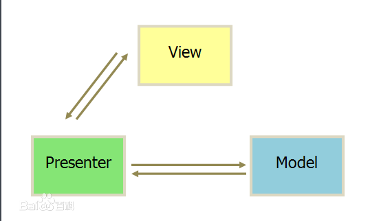

#MVP架构

###什么是MVP

MVP是MVC的变种，其中Model和View的定义与MVC的一致，不同点在于：MVC的Controller是管理一组Model与View之间交互逻辑，是一个管理者；而Presenter（展示者）则是Model于View之间的连接者，针对特定模块的View提供对应的格式化的Model数据，将View中的行为反馈到Model中。所以MVC中的Controller一般会管理一个或多个Model和一个或多个View，而Presenter则是 M-P-V 一对一，有更细的粒度和更好的解耦。是针对有GUI存在的应用程序，目的在于，对于GUI层来说，把UI展示与逻辑分开。

###MVP结构图

####组成

- (1)View:负责绘制UI元素、与用户进行交互;
- (2)View interface:需要View实现的接口，View通过View interface与Presenter进行交互，降低耦合，方便进行单元测试;
- (3)Model:负责存储、检索、操纵数据(有时也实现一个Model interface用来降低耦合)，为UI层提供的数据，或者保存UI层传下来的数据;
- (4)Presenter:作为View与Model交互的中间纽带，处理与用户交互的负责逻辑；逻辑控制层，从Model处取数据，运算和转化，最后用View来展示；并处理View传过来的用户事件，并做处理。

####规则
- Model与View不能直接通信，只能通过Presenter
- Presenter类似于中间人的角色进行协调和调度
- Model和View是接口，Presenter持有的是一个Model接口和一个View接口
- Model和View都应该是被动的，一切都由Presenter来主导
- Model应该把与业务逻辑层的交互封装掉，换句话说Presenter和View不应该知道业务逻辑层
- View的逻辑应该尽可能的简单，不应该有状态。当事件发生时，调用Presenter来处理，并且不传参数，Presenter处理时再调用View的方法来获取。

###MVP好处

- 逻辑放在Presenter中
- View和Model抽象成为接口
- 代码更加容易移植
- 代码更加容易加入Unit Testing

##参考文章

1.Andriod MVP架构 
<http://toughcoder.net/blog/2015/11/29/understanding-android-mvp-pattern/>