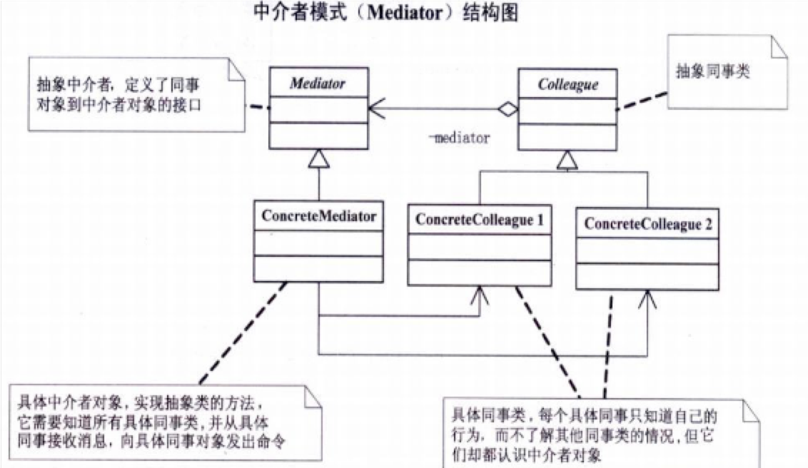
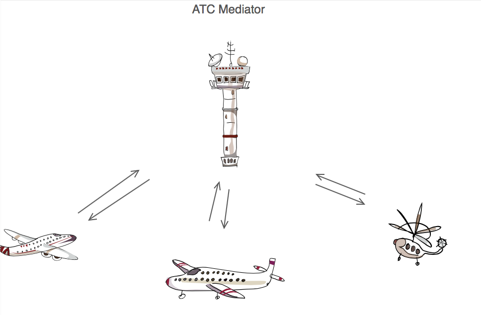

#中介模式(Mediator)

##背景
在面向对象的软件设计与开发过程中，根据“单一职责原则”，我们应该尽量将对象细化，使其只负责或呈现单一的职责，即将行为分布到各个对象中。

对于一个模块或者系统，可能由很多对象构成，而且这些对象之间可能存在相互的引用，在最坏的情况下，每一个对象都知道其他所有的对象，这无疑复杂化了对象之间的联系。虽然将一个系统分割成许多对象通常可以增强可复用性，但是对象间相互连接的激增又会降低其可复用性，大量的相互连接使得一个对象似乎不太可能在没有其他对象的支持下工作，系统表现为一个不可分割的整体，而且对系统的行为进行任何较大的改动都会十分困难。结果是你不得不定义大量的子类以定制系统的行为。因此，为了减少对象两两之间复杂的引用关系，使之成为一个松耦合的系统，我们需要使用中介者模式.

####问题

面对一系列的相交互对象。怎么样保证使各对象不需要显式地相互引用，使其耦合松散？

####解决方案

中介者模式：用一个中介对象来封装一系列的对象交互。中介者使各对象不需要显式地相互引用，从而使其耦合松散，而且可以独立地改变它们之间的交互。中介者模式又称为调停者模式。

##剖析
###意图
 定义对象封装一些列对象间交互。Mediator

###定义

- 用一个中介对象来封装一系列的对象交互。中介者是各对象不需要显示地相互引用，从而使其耦合松散，而且可以独立地改变他们之间的交互。
- 设计中介去耦
- 在交互对象间，促进多对多关系

###本质
- 封装交互

##UML

###图例解读
- 抽象中介者：定义好同事类对象到中介者对象的接口，用于各个同事类之间的通信。一般包括一个或几个抽象的事件方法，并由子类去实现。

- 中介者实现类：从抽象中介者继承而来，实现抽象中介者中定义的事件方法。从一个同事类接收消息，然后通过消息影响其他同时类。

- 同事类：如果一个对象会影响其他的对象，同时也会被其他对象影响，那么这两个对象称为同事类。在类图中，同事类只有一个，这其实是现实的省略，在实际应用中，同事类一般由多个组成，他们之间相互影响，相互依赖。同事类越多，关系越复杂。并且，同事类也可以表现为继承了同一个抽象类的一组实现组成。在中介者模式中，同事类之间必须通过中介者才能进行消息传递。
##现实例子

##应用场景

- 对象间的交互虽定义明确然而非常复杂，导致一组对象彼此相互依赖而难以理解；
- 因为对象引用了许多其他对象并通讯，导致对象难以复用。
- 想要定制一个分布在多个类中的逻辑或行为，又不想生成太多子类。

- N个对象之间产生了相互依赖的关系
- 多个对象有依赖关系，但是依赖行为尚不确定或者发生改变的可能
- 产品研发
##优缺点
###优点
- 松散耦合
- 集中控制交互
- 多对多变成一对多
- 较少了子类的生成
- 简化了各同事类的设计与实现
- 简化了对象协议
- 对对象如何协作进行了抽象
- 减少类之间的依赖，把原有的一对多的依赖变成了一对一的依赖，同事类只依赖中介者，减少了依赖，当然同时也降低了类之间的耦合

###缺点
- 过度集中化
- 中介者膨胀的很大，而且逻辑复杂

##模式导读
在面向对象编程中，一个类必然会与其他的类发生依赖关系，完全独立的类是没有意义的。一个类同时依赖多个类的情况也相当普遍，既然存在这样的情况，说明，一对多的依赖关系有它的合理性，适当的使用中介者模式可以使原本凌乱的对象关系清晰，但是如果滥用，则可能会带来反的效果。一般来说，只有对于那种同事类之间是网状结构的关系，才会考虑使用中介者模式。可以将网状结构变为星状结构，使同事类之间的关系变的清晰一些。

中介者模式是一种比较常用的模式，也是一种比较容易被滥用的模式。对于大多数的情况，同事类之间的关系不会复杂到混乱不堪的网状结构，因此，大多数情况下，将对象间的依赖关系封装的同事类内部就可以的，没有必要非引入中介者模式。滥用中介者模式，只会让事情变的更复杂。

- 适当地使用中介者模式可以避免同事类之间的过度耦合，使得各同事类之间可以相对独立地使用。

- 使用中介者模式可以将对象间一对多的关联转变为一对一的关联，使对象间的关系易于理解和维护。

- 使用中介者模式可以将对象的行为和协作进行抽象，能够比较灵活的处理对象间的相互作用。

##经验法则

- 责任链、命令、中介和观察者,解决如何解耦发送方和接收方的,但是不同的权衡。责任链通过发送方请求找到接受方。命令模式通常与一个子类制定 发送-接收连接。中介者间接有发送方和接受引用。观察者定义了一个解耦的接口，允许多个接收器运行时配置。
- 中介和观察者都是竞争者模式。他们之间不同的是，观察者模式通过引入观察者 和主题 对象来通信，而中介者封装其他对象之间的通信。
- 另一方面，中介可以利用观察者动态观察，与他们交流
- 与外观模式相似，抽象存在类的功能。

