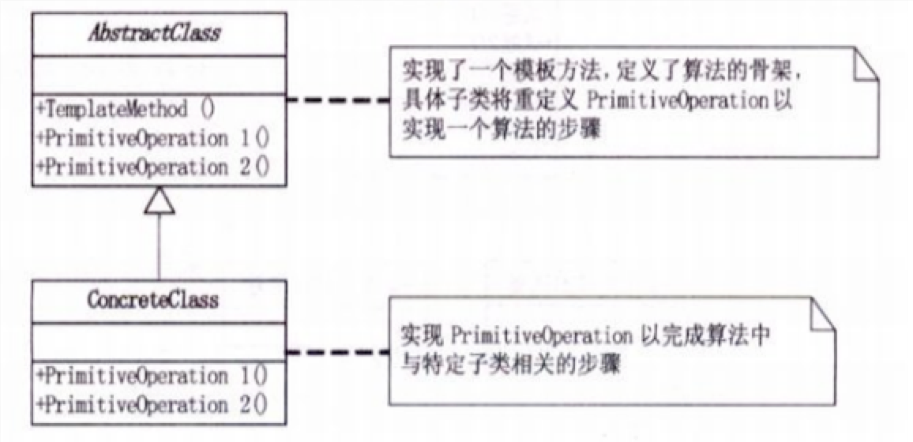
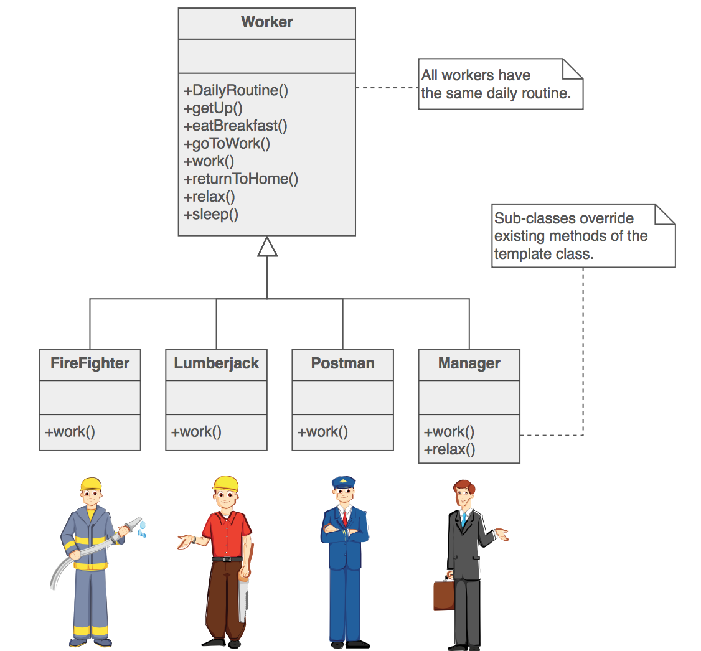

#模板方法模式(Template Method)

##背景
####1.概述

在面向对象开发过程中，通常我们会遇到这样的一个问题：我们知道一个算法所需的关键步骤，并确定了这些步骤的执行顺序。但是某些步骤的具体实现是未知的，或者说某些步骤的实现与具体的环境相关。

####2.问题

如何保证架构逻辑的正常执行，而不被子类破坏 ？

####3.解决方案

模板方法：定义一个操作中的算法的骨架，而将一些步骤延迟到子类中。 T模板方法使得子类可以不改变一个算法的结构即可重定义该算法的某些特定步骤。

1）模板方法模式是基于继承的代码复用基本技术，模板方法模式的结构和用法也是面向对象设计的核心之一。在模板方法模式中，可以将相同的代码放在父类中，而将不同的方法实现放在不同的子类中。
2）在模板方法模式中，我们需要准备一个抽象类，将部分逻辑以具体方法以及具体构造函数的形式实现，然后声明一些抽象方法来让子类实现剩余的逻辑。不同的子类可以以不同的方式实现这些抽象方法，从而对剩余的逻辑有不同的实现，这就是模板方法模式的用意。模板方法模式体现了面向对象的诸多重要思想，是一种使用频率较高的模式。

###思考

- 1）模板方法模式是基于继承的代码复用基本技术，模板方法模式的结构和用法也是面向对象设计的核心之一。在模板方法模式中，可以将相同的代码放在父类中，而将不同的方法实现放在不同的子类中。
- 2）在模板方法模式中，我们需要准备一个抽象类，将部分逻辑以具体方法以及具体构造函数的形式实现，然后声明一些抽象方法来让子类实现剩余的逻辑。不同的子类可以以不同的方式实现这些抽象方法，从而对剩余的逻辑有不同的实现，这就是模板方法模式的用意。模板方法模式体现了面向对象的诸多重要思想，是一种使用频率较高的模式。

##剖析
#### 定义

- 定义一个操作中的算法的骨架，而将一些步骤延迟到子类中。模板方法使得子类可以不改变一个算法结构即可重定义该算法的某些特定步骤。

#### 本质

- 固定算法骨架

##UML

####模式组成

- 抽象类（AbstractClass）: 定义抽象的原语操作（primitive operation） ，具体的子类将重定义它们以实现一个算法， 实现一个模板方法,定义一个算法的骨架。该模板方法不仅调用原语操作，也调用定义
- 具体子类 （ConcreteClass）:  实现原语操作以完成算法中与特定子类相关的步骤。

##例子

##场景
- 需要一次性实现算法的不变部分，并将可变行为留给子类来实现。
- 子类的共同行为应该提取出来放到公共类中，以避免代码重复。现有的代码差别应该被分离为新的操作。然后用一个调用这些新操作的模板方法来替换这些不同的代码。
- 需要控制子类的扩展。可以定义一个在特定点调用“钩子”操作的模板方法。子类可以通过对钩子操作的实现在这些点扩展功能。

## 扩展

- 模板方法调用5种类型操作：
- 对具体类或客户端的二聚体操作
- 对抽象类的具体操
- 抽象操作
- 工厂方法
- 钩子操作

##优缺点

####优点：

- 1)模板方法模式在一个类中形式化地定义算法，而由它的子类实现细节的处理。
- 2)模板方法是一种代码复用的基本技术。它们在类库中尤为重要，它们提取了类库中的公共行为。
- 3)模板方法模式导致一种反向的控制结构，这种结构有时被称为“好莱坞法则” ，即“别找我们，,我们找你”通过一个父类调用其子类的操作(而不是相反的子类调用父类)，通过对子类的扩展增加新的行为，符合“开闭原则”
- 封装不变的部分，扩展可变部分
- 提取公共部分代码，便于维护
- 行为有父类控制，子类实现

####缺点:
- 每个不同的实现都需要定义一个子类，这会导致类的个数增加，系统更加庞大，设计也更加抽象，但是更加符合“单一职责原则”，使得类的内聚性得以提高。

      3.抽象类负责声明最抽象，最一般的事物属性和方法实现类完成具体事物属性和方法，但是模板方法模式颠倒了，抽象下定义了部分抽象方法，由子类实现，子类执行结果影响了父类的结果，也就是子类对父类产生了影响
      
##总结

- 1）模板方法模式是一种类的行为型模式，在它的结构图中只有类之间的继承关系，没有对象关联关系。
- 2）板方法模式是基于继承的代码复用基本技术，模板方法模式的结构和用法也是面向对象设计的核心之一。在模板方法模式中，可以将相同的代码放在父类中，而将不同的方法实现放在不同的子类中。
- 3）在模板方法模式中，我们需要准备一个抽象类，将部分逻辑以具体方法以及具体构造函数的形式实现，然后声明一些抽象方法来让子类实现剩余的逻辑。不同的子类可以以不同的方式实现这些抽象方法，从而对剩余的逻辑有不同的实现，这就是模板方法模式的用意。模板方法模式体现了面向对象的诸多重要思想，是一种使用频率较高的模式。

###经验法则

- 除了粒度方面，Strategy与模板方法类似
- 模板方法使用继承来改变算法的一部分。策略模式使用代理来改变整个算法
-  策略模式修改了单独对象的逻辑。模板方法修改了整个类的逻辑
- 工厂方法是模板方法的专业化

正向依赖 VS  依赖倒置

模板方法模式的本质是依赖倒置
模板方法模式可以确保操作流程不变 的情况。赋予用户最大的自由度
模板方法模式也是实现代码重构的重要手段

