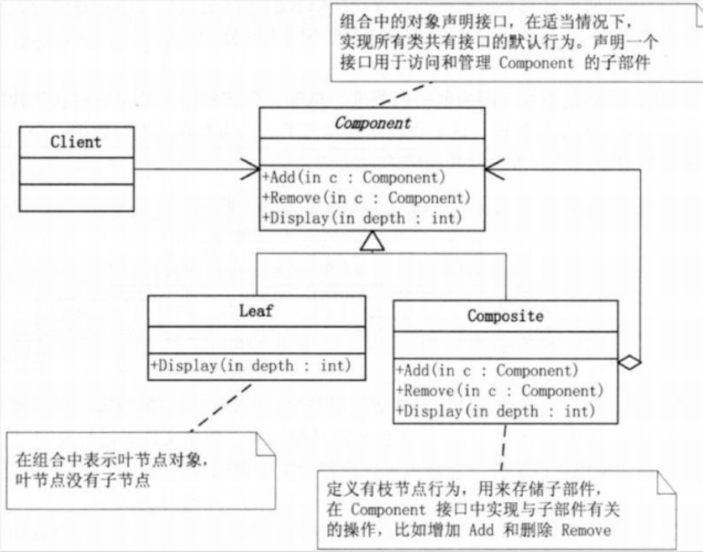

#组合模式Composite

#背景
我们可以使用简单的对象组合成复杂的对象，而这个复杂对象有可以组合成更大的对象。我们可以把简单这些对象定义成类，然后定义一些容器类来存储这些简单对象。客户端代码必须区别对象简单对象和容器对象，而实际上大多数情况下用户认为它们是一样的。对这些类区别使用，使得程序更加复杂。递归使用的时候跟麻烦，而我们如何使用递归组合，使得用户不必对这些类进行区别呢？

###解决方案

   组合模式：将对象组合成树形结构以表示“部分-整体”的层次结构。Composite使得用户对单个对象和组合对象的使用具有一致性。

   有时候又叫做部分-整体模式，它使我们树型结构的问题中，模糊了简单元素和复杂元素的概念，客户程序可以向处理简单元素一样来处理复杂元素,从而使得客户程序与复杂元素的内部结构解耦。

　　组合模式让你可以优化处理递归或分级数据结构。有许多关于分级数据结构的例子，使得组合模式非常有用武之地。关于分级数据结构的一个普遍性的例子是你每次使用电脑时所遇到的:文件系统。文件系统由目录和文件组成。每个目录都可以装内容。目录的内容可以是文件，也可以是目录。按照这种方式，计算机的文件系统就是以递归结构来组织的。如果你想要描述这样的数据结构，那么你可以使用组合模式Composite。
　　
#剖析

###定义

- 将对象组合成树形结构以表示 部分-整体 的层次结构。组合模式使得用户对单个对象和组合对象的使用具有一致性。

###本质

- 统一叶子对象和组合对象

#UML

####分类

- 1)    将管理子元素的方法定义在Composite类中
- 2)    将管理子元素的方法定义在Component接口中，这样Leaf类就需要对这些方法空实现。

####模式组成

- 抽象构件角色（component）：是组合中的对象声明接口，在适当的情况下，实现所有类共有接口的默认行为。声明一个接口用于访问和管理Component子部件。
- 这个接口可以用来管理所有的子对象。(可选)在递归结构中定义一个接口，用于访问一个父部件，并在合适的情况下实现它。
- 树叶构件角色(Leaf)：在组合树中表示叶节点对象，叶节点没有子节点。并在组合中定义图元对象的行为。
- 树枝构件角色（Composite）：定义有子部件的那些部件的行为。存储子部件。在Component接口中实现与子部件有关的操作。
- 客户角色（Client）：通过component接口操纵组合部件的对象。
#扩展

- 透明方式：在Component中声明所有用来管理子对象的方法，其中包括Add,Remove等。这样实现Component接口的所有子类都具备饿Add和Remove。这样做的好处就是叶节点和枝节点对于外界没有区别，他们具备完全一致的行为接口。但是问题也很明显，因为Leaf类本身不具备Add(),Remove方法的功能，所以实现他是没有意义的
- 安全方式：在Conponent接口不去声明Add和Remove方法，那么子类的Leaf也就不需要去实现它，而是在Composite声明所有用来管理子类对象的方法。不过由于不够透明，所以树叶和树枝类将不具有相同的接口，客户端的调用做相应的判断，带来了不便。
- 关键在于抽象类，可以代表叶子对象，也可以代表组合对象，这样用户在操作的时候，对这个对象和组合对的使用就具有了一致性。

#优点
- 1) 定义了包含基本对象和组合对象的类层次结构 基本对象可以被组合成更复杂的组合对象，而这个组合对象又可以被组合，这样不断的递归下去。客户代码中，任何用到   基本对象的地方都可以使用组合对象。
-  2) 简化客户代码 客户可以一致地使用组合结构和单个对象。通常用户不知道 (也不关心)处理的是一个叶节点还是一个组合组件。这就简化了客户代码 , 因为在定义组合的那些类中不需要写一些充斥着选择语句的函数。
-  3) 使得更容易增加新类型的组件 新定义的Composite或Leaf子类自动地与已有的结构和客户代码一起工作，客户程序不需因新的Component类而改变。
-  4) 使你的设计变得更加一般化 容易增加新组件也会产生一些问题，那就是很难限制组合中的组件。有时你希望一个组合只能有某些特定的组件。使用Composite时，你不能依赖类型系统施加这些约束，而必须在运行时刻进行检查。

#何时使用

- 组合模式解耦了客户程序与复杂元素内部结构，从而使客户程序可以向处理简单元素一样来处理复杂元素。
- 如果你想要创建层次结构，并可以在其中以相同的方式对待所有元素，那么组合模式就是最理想的选择。

#模式解读
组合模式是一种融合了继承机制合聚合机制的递归模型，透明和安全是使用复合模式时需要着重考虑的两个问题；

