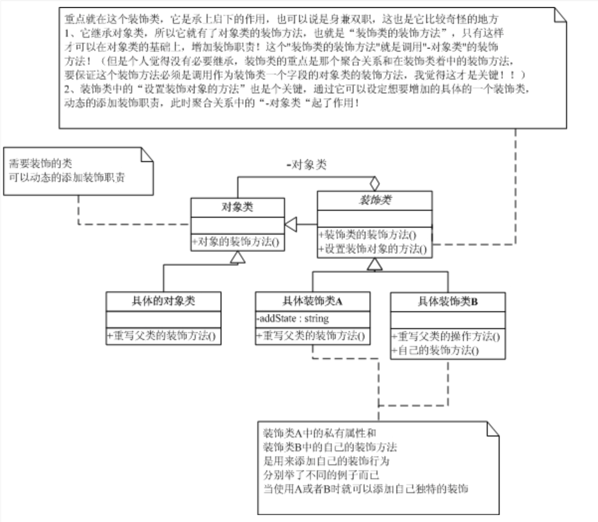
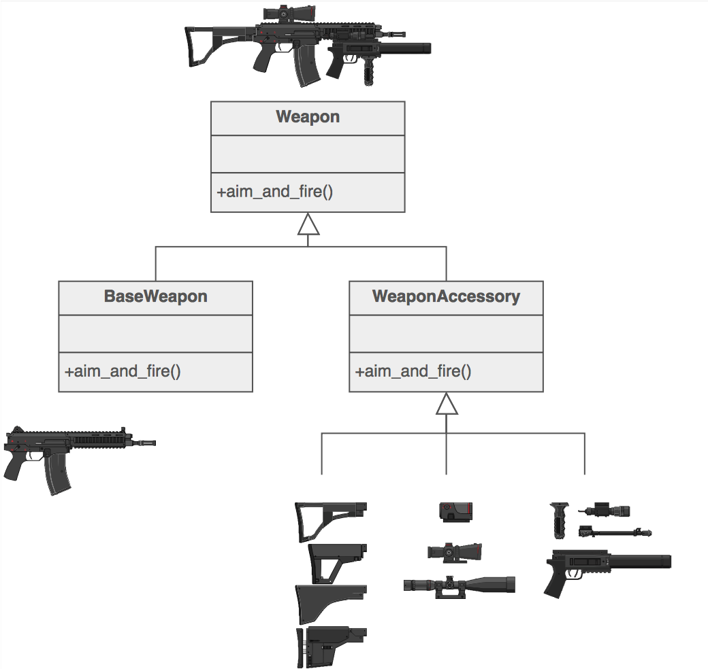

#装饰者Decorator

##背景

###问题
- 你如何组织你的代码使其可以容易的添加基本的或者一些很少用到的 特性，而不是直接不额外的代码写在你的类的内部？

###解决方案

 - 装饰器模式： 动态地给一个对象添加一些额外的职责或者行为。就增加功能来说， Decorator模式相比生成子类更为灵活。
 - 装饰器模式提供了改变子类的灵活方案。装饰器模式在不必改变原类文件和使用继承的情况下，动态的扩展一个对象的功能。它是通过创建一个包装对象，也就是装饰来包裹真实的对象。
 - 当用于一组子类时，装饰器模式更加有用。如果你拥有一族子类（从一个父类派生而来），你需要在与子类独立使用情况下添加额外的特性，你可以使用装饰器模式，以避免代码重复和具体子类数量的增加。
 
 
##剖析
 
####意图

- 将额外的责任自动附加到一个对象上。装饰模式提供了灵活的子类来扩展功能
- client-specified  通过封装装饰了一个核心对象
- 包装礼物，放进盒子里，包装盒子

####定义
- 动态地改一个对象添加一些额外的职责。就增加功能来说，装饰模式比生成子类更为灵活

####本质

- 动态组合

####模式讲解

- 动态的实现为对象添加功能
- 思考起点： 对象组合
- 装饰器：给被装饰对象增加功能，还可以根据需要选择是否调用装饰对象的功能
- 装饰器一定要和组件类一致的接口，保证他们是同一个类型，并具有同一个外观
- 退化形式：没有必要设计抽象类了

####特点
（1） 装饰对象和真实对象有相同的接口。这样客户端对象就可以以和真实对象相同的方式和装饰对象交互。
　　（2） 装饰对象包含一个真实对象的索引（reference）
　　（3） 装饰对象接受所有的来自客户端的请求。它把这些请求转发给真实的对象。

　　（4） 装饰对象可以在转发这些请求以前或以后增加一些附加功能。这样就确保了在运行时，不用修改给定对象的结构就可以在外部增加附加的功能。在面向对象的设计中，通常是通过继承来实现对给定类的功能扩展。

##UML

####模式的组成

抽象组件角色(Component)：定义一个对象接口，以规范准备接受附加责任的对象，

即可以给这些对象动态地添加职责。

具体组件角色(ConcreteComponent) :被装饰者，定义一个将要被装饰增加功能的类。

可以给这个类的对象添加一些职责

抽象装饰器(Decorator):维持一个指向构件Component对象的实例，

并定义一个与抽象组件角色Component接口一致的接口

具体装饰器角色（ConcreteDecorator):向组件添加职责。

##Example

##场景

- 何时使用

1.想在不影响其它对象的情况下，以动态，透明的方式给单个对象添加职责。
2.想要扩展一个类的行为，却做不到。类定义可能被隐藏，无法进行子类化，或者对类的每个行为的扩展，为支持每种功能组合，将产生大量的子类。

- 使用场景

1.需要扩展一个类的功能，或给一个类增加附加功能
2.需要动态的给一个对象添加功能，这些功能可以再动态的侧撤销
3.为一批兄弟类进行改装或加装功能
对继承的有力补充

##优缺点
1) 比静态继承更灵活： 与对象的静态继承（多重继承）相比， Decorator模式提供了更加灵活的向对象添加职责的方式。可以用添加和分离的方法，用装饰在运行时刻增加和删除职责。相比之下，继承机制要求为每个添加的职责创建一个新的子类。这会产生许多新的类，并且会增加系统的复杂度。此外，为一个特定的Component类提供多个不同的 Decorator类，这就使得你可以对一些职责进行混合和匹配。使用Decorator模式可以很容易地重复添加一个特性。
2) 避免在层次结构高层的类有太多的特征 Decorator模式提供了一种“即用即付”的方法来添加职责。它并不试图在一个复杂的可定制的类中支持所有可预见的特征，相反，你可以定义一个简单的类，并且用 Decorator类给它逐渐地添加功能。可以从简单的部件组合出复杂的功能。这样，应用程序不必为不需要的特征付出代价。同时更易于不依赖于 Decorator所扩展（甚至是不可预知的扩展）的类而独立地定义新类型的 Decorator。扩展一个复杂类的时候，很可能会暴露与添加的职责无关的细节。
3) Decorator与它的Component不一样 Decorator是一个透明的包装。如果我们从对象标识的观点出发，一个被装饰了的组件与这个组件是有差别的，因此，使用装饰不应该依赖对象标识。
4) 有许多小对象 采用Decorator模式进行系统设计往往会产生许多看上去类似的小对象，这些对象仅仅在他们相互连接的方式上有所不同，而不是它们的类或是它们的属性值有所不同。尽管对于那些了解这些系统的人来说，很容易对它们进行定制，但是很难学习这些系统，排错也很困难。
####优点
- 比继承更灵活
- 更容易复用功能
- 简化高层定义

####缺点

- 产生很多细粒度对象
- 相关模式
- 策略模式

##相关模式

1）Adapter 模式：Decorator模式不同于Adapter模式，因为装饰仅改变对象的职责而

不改变它的接口；而适配器将给对象一个全新的接口。

2）Composite模式：可以将装饰视为一个退化的、仅有一个组件的组

合。然而，装饰仅给对象添加一些额外的职责—它的目的不在于对象聚集。

3）Strategy模式：用一个装饰你可以改变对象的外表；而Strategy模

式使得你可以改变对象的内核。这是改变对象的两种途径。

##经验法则

- 适配器提供不同的接口给他的子对象。代理提供相同的接口，装饰模式增强了接口
- 适配器改变了对象的接口，装饰器加强了对象的责任。装饰器模式对客户端更加透明。因此，装饰支持递归组合，并不是纯粹的适配器
- 组合模式和装饰器模式有相同结构的语法，反映了递归组合管理开放对象树
- 修饰符可以被视为一种只有一个退化符合组件。装饰模式增加了额外的模式--他不是面向对象聚合
- 装饰模式设计目的为了让你给对象增加责任而不是子类。组合类的目的不是装饰而是表示。他们的目的不同，但是互补。
- 组合使用责任链模式通过父类访问全局性。在组合模式部分组成中也使用装饰模式覆盖这些属性。
- 装饰模式和代理模式有不同的目的但是相同的结构。提供了另一个对象间接层。，实现了保留了一个引用到前向请求的对象。
- 装饰模式改变了对象的外部。策略模式改变了内部。

##总结
- 1）使用装饰器设计模式设计类的目标是： 不必重写任何已有的功能性代码，而是对某个基于对象应用增量变化。

- 2) 装饰器设计模式采用这样的构建方式： 在主代码流中应该能够直接插入一个或多个更改或“装饰”目标对象的装饰器，同时不影响其他代码流。
- 3) Decorator模式采用对象组合而非继承的手法，实现了在运行时动态的扩展对象功能的能力，而且可以根据需要扩展多个功能，避免了单独使用继承带来的“灵活性差”和“多子类衍生问题”。
同时它很好地符合面向对象设计原则中“优先使用对象组合而非继承”和“开放-封闭”原则。
也许装饰器模式最重要的一个方面是它的超过继承的能力。“问题”部分展现了一个使用继承的子类爆炸。
基于装饰器模式的解决方案，UML类图展现了这个简洁灵活的解决方案。

从外部变更

每个节点不知道装饰(外表的变更)

策略(内容的变更)

从内部变更

每个节点知道一组预定义的变更方式

