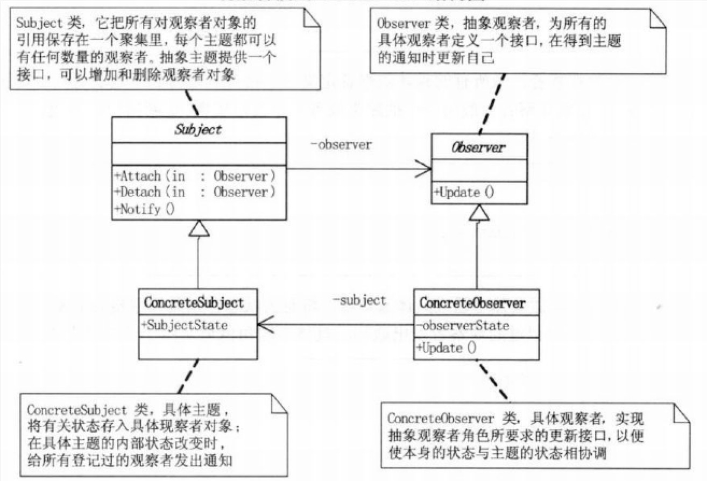
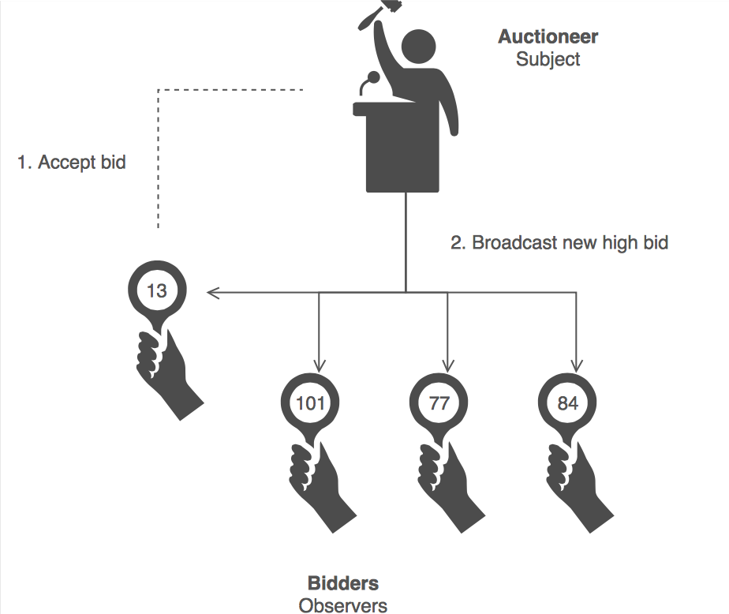

#观察者模式Observer

##背景
### 1.概述
一些面向对象的编程方式，提供了一种构建对象间复杂网络互连的能力。当对象们连接在一起时，它们就可以相互提供服务和信息。
通常来说，当某个对象的状态发生改变时，你仍然需要对象之间能互相通信。但是出于各种原因，你也许并不愿意因为代码环境的改变而对代码做大的修改。也许，你只想根据你的具体应用环境而改进通信代码。或者，你只想简单的重新构造通信代码来避免类和类之间的相互依赖与相互从属。

###2.问题
当一个对象的状态发生改变时，你如何通知其他对象？是否需要一个动态方案――一个就像允许脚本的执行一样，允许自由连接的方案？
###3.解决方案
 观察模式：定义对象间的一种一对多的依赖关系,当一个对象的状态发生改变时, 所有依赖于它的对象都得到通知并被自动更新。

- 观察模式允许一个对象关注其他对象的状态，并且，观测模式还为被观测者提供了一种观测结构，或者说是一个主体和一个客体。主体，也就是被观测者，可以用来联系所有的观测它的观测者。客体，也就是观测者，用来接受主体状态的改变 观测就是一个可被观测的类（也就是主题）与一个或多个观测它的类（也就是客体）的协作。不论什么时候，当被观测对象的状态变化时，所有注册过的观测者都会得到通知。
- 观察模式将被观测者（主体）从观测者（客体）种分离出来。这样，每个观测者都可以根据主体的变化分别采取各自的操作。（观测模式和Publish/Subscribe模式一样，也是一种有效描述对象间相互作用的模式。）观测模式灵活而且功能强大。对于被观测者来说，那些查询哪些类需要自己的状态信息和每次使用那些状态信息的额外资源开销已经不存在了。另外，一个观测者可以在任何合适的时候进行注册和取消注册。你也可以定义多个具体的观测类，以便在实际应用中执行不同的操作。
- 将一个系统分割成一系列相互协作的类有一个常见的副作用：需要维护相关对象间的一致性。我们不希望为了维持一致性而使各类紧密耦合，因为这样降低了它们的可重用性。

##剖析
###1.意图

- 在对象间定义一对多的依赖，以至于当一个对象状态改变时，依赖者自动收到通知且更新。
- 在Subject中封装核心组件，在观察者层次中封装变量组件
- mvc  中view部分

###2.定义

- 定义对象间的一种一对多的依赖关系。当一个对象的状态发生改变时，所有依赖于他的对象都得到通知并被自动更新。

###3.本质

- 触发联动

##UML

###UML解读
- 被观察者：从类图中可以看到，类中有一个用来存放观察者对象的Vector容器（之所以使用Vector而不使用List，是因为多线程操作时，Vector在是安全的，而List则是不安全的），这个Vector容器是被观察者类的核心，另外还有三个方法：attach方法是向这个容器中添加观察者对象；detach方法是从容器中移除观察者对象；notify方法是依次调用观察者对象的对应方法。这个角色可以是接口，也可以是抽象类或者具体的类，因为很多情况下会与其他的模式混用，所以使用抽象类的情况比较多。
- 观察者：观察者角色一般是一个接口，它只有一个update方法，在被观察者状态发生变化时，这个方法就会被触发调用。
- 具体的被观察者：使用这个角色是为了便于扩展，可以在此角色中定义具体的业务逻辑。
- 具体的观察者：观察者接口的具体实现，在这个角色中，将定义被观察者对象状态发生变化时所要处理的逻辑。
-
##例子

##场景
- • 当一个抽象模型有两个方面, 其中一个方面依赖于另一方面。将这二者封装在独立的对象中以使它们可以各自独立地改变和复用。
- • 当对一个对象的改变需要同时改变其它对象 , 而不知道具体有多少对象有待改变。
- • 当一个对象必须通知其它对象，而它又不能假定其它对象是谁。换言之 , 你不希望这些对象是紧密耦合

##优缺点
###优点
- 1 )观察者模式可以实现表示层和数据逻辑层的分离,并定义了稳定的消息更新传递机制，抽象了更新接口，使得可以有各种各样不同的表示层作为具体观察者角色。
- 2 )在观察目标和观察者之间建立一个抽象的耦合 ：一个目标所知道的仅仅是它有一系列观察者 , 每个都符合抽象的Observer类的简单接口。目标不知道任何一个观察者属于哪一个具体的类。这样目标和观察者之间的耦合是抽象的和最小的。因为目标和观察者不是紧密耦合的, 它们可以属于一个系统中的不同抽象层次。一个处于较低层次的目标对象可与一个处于较高层次的观察者通信并通知它 , 这样就保持了系统层次的完整。如果目标和观察者混在一块 , 那么得到的对象要么横贯两个层次 (违反了层次性), 要么必须放在这两层的某一层中(这可能会损害层次抽象)。
- 3) 支持广播通信 :不像通常的请求, 目标发送的通知不需指定它的接收者。通知被自动广播给所有已向该目标对象登记的有关对象。目标对象并不关心到底有多少对象对自己感兴趣 ;它唯一的责任就是通知它的各观察者。这给了你在任何时刻增加和删除观察者的自由。处理还是忽略一个通知取决于观察者。
- 4) 观察者模式符合“开闭原则”的要求。
- 观察者和被观察者之间是抽象耦合
- 建立一套触发机制
###缺点
- 1) 如果一个观察目标对象有很多直接和间接的观察者的话，将所有的观察者都通知到会花费很多时间。
- 2) 如果在观察者和观察目标之间有循环依赖的话，观察目标会触发它们之间进行循环调用，可能导致系统崩溃。
- 3) 观察者模式没有相应的机制让观察者知道所观察的目标对象是怎么发生变化的，而仅仅只是知道观察目标发生了变化。

##模式解读
###经验法则
- 中介者模式间接有发送者和接收者引用。观察者模式定义了一个解耦的接口，容许在运行时安装多个接收者
- 中介者模式 和观察者模式 是competing patterns.观察者模式通过观察者和 subObject发布交流，而中介者模式在对象间封装了交流。比复用中介者模式，我们发现更容易复用Observers 和 Subjects.
- 另一方面，中介者模式可以动态的注册 colleagues 和他们交流。
###分类

- 推模型：目标对象主动向观察者推送目标的详细信息，不管观察者是否需要，推送的信息通常是目标对象的全部或部分数据，相当于广播通信。
- 拉模型：目标对象在通知观察者的时候，之传递少量的信息。如果观察者需要更具体的信息，由观察者主动到目标对象拉数据。一般这种模型的实现中，会把目标对象自身通过update方法传递给观察者，这样子观察者需要获取数据的时候，就通过这个引用获取
- 对比：推模型是假定目标对象知道观察者需要的数据而拉模型是目标对象不知道观察者需要什么数据；推模型可能会使得观察者对象难以复用。
###注意点
- 触发机制
- 关联行为场景
- 事件多级触发场景
- 跨系统的消息交换场景
- 相互观察容易出现死循环
- 数据先修改在通知
- 在观察者模式中，观察者与目标是单向依赖的，只有观察者依赖于目标，而目标是不会依赖于观察者

###扩展

- 委托就是一种引用方法的类型。一旦为委托分配了方法，委托将于该方法具有完全相同的行为。委托方法的使用可以像其他任何方法一样，具有参数和返回值。委托可以看做是对函数的抽象，是函数的类，委托的实例将代表一个具体的函数。
- 一个委托可以搭载多个方法，所有方法被一次唤起。 可以使得委托对象所搭载的方法并不需要属于同一个类。
- 委托对象所搭载的所有方法必须具有相同的原型和形式，也就是拥有相同参数列表和返回值类型。