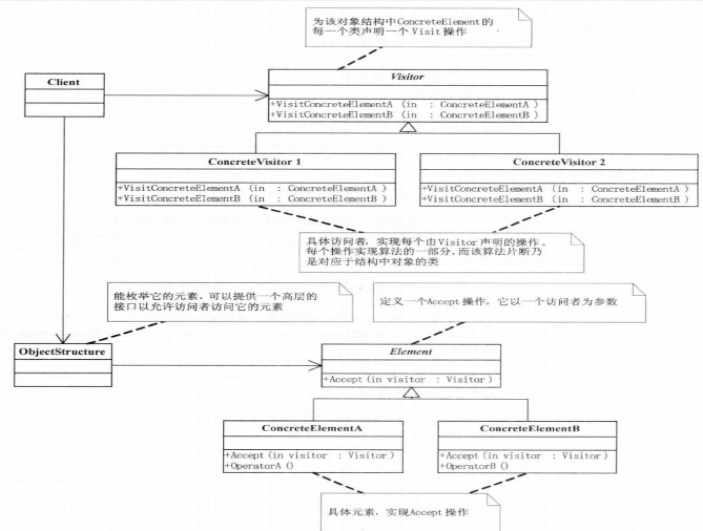

#访问者模式Visitor

##背景
###1.概述

- 在软件开发过程中，对于系统中的某些对象，它们存储在同一个集合collection中，且具有不同的类型，而且对于该集合中的对象，可以接受一类称为访问者的对象来访问，而且不同的访问者其访问方式有所不同

###2.问题

- 对同一集合对象的操作并不是唯一的，对相同的元素对象可能存在多种不同的操作方式。而且这些操作方式并不稳定，如果对需要增加新的操作，如何满足新的业务需求？

###3.解决方案

- 访问者模式：表示一个作用于某对象结构中的各元素的操作。它使你可以在不改变各元素的类的前提下定义作用于这些元素的新操作。

- 1）访问者模式中对象结构存储了不同类型的元素对象，以供不同访问者访问。
2）访问者模式包括两个层次结构，一个是访问者层次结构，提供了抽象访问者和具体访问者，一个是元素层次结构，提供了抽象元素和具体元素。
相同的访问者可以不同的方式访问不同的元素，相同的元素可以接受不同访问者以不同访问方式访问。在访问者模式中，增加新的访问者无须修改原有系统，系统具有较好的可扩展性

##剖析
### 定义

- 表示一个作用于某个对象结构中各元素的操作。它使你可以再不改变各元素的类的前提下定义这些元素的新操作。
- 1）访问者模式中对象结构存储了不同类型的元素对象，以供不同访问者访问。
- 2）访问者模式包括两个层次结构，一个是访问者层次结构，提供了抽象访问者和具体访问者，一个是元素层次结构，提供了抽象元素和具体元素。
相同的访问者可以以不同的方式访问不同的元素，相同的元素可以接受不同访问者以不同访问方式访问。在访问者模式中，增加新的访问者无须修改原有系统，系统具有较好的可扩展性

###本质

- 预留通路，回调实现

##UML

### 模式组成

- 抽象访问者（Vistor）: — 为该对象结构中ConcreteElement的每一个类声明一个Visit操作。该操作的名字和特
- 征标识了发送Visit请求给该访问者的那个类。这使得访问者可以确定正被访问元素
- 的具体的类。这样访问者就可以通过该元素的特定接口直接访问它。
- 具体访问者（ConcreteVisitor）: — 实现每个由Visitor声明的操作。每个操作实现本算法的一部分，而该算法片断乃是
- 对应于结构中对象的类。ConcreteVisitor为该算法提供了上下文并存储它的局部状态。
- 这一状态常常在遍历该结构的过程中累积结果。
-  抽象元素（Element）：定义一个Accept操作，它以一个访问者为参数。
- 具体元素（ConcreteElement）:   实现Accept操作，该操作以一个访问者为参数。
- 对象结构（ObjectStructure）: 能枚举它的元素。可以提供一个高层的接口以允许该访问者访问它的元素。可以是一个复合或是一个集合，如一个列表或一个无序集合。

##何时使用

- 一个复杂的对象结构包含很多其他对象，他们有不同的接口，但是想对这些对象实施一些依赖于具体类型的操作。
- 需要对一个组合结构中的对具体对象进行很多不相关的操作，但是不想比这些对象“污染”这些对象的类，可以将相关的操作集中起来，定义一个访问者类中，并在需要在访问者中定义的操作时使用它。
- 定义复杂的类很少做修改，但经常需要向其添加新的操作。

##优缺点
####优点:

- •使得增加新的访问操作变得很容易。如果一些操作依赖于一个复杂的结构对象的话，那么一般而言，增加新的操作会很复杂。而使用访问者模式，增加新的操作就意味着增加一个新的访问者类，因此，变得很容易。
- •将有关元素对象的访问行为集中到一个访问者对象中，而不是分散到一个个的元素类中。
- •访问者模式可以跨过几个类的等级结构访问属于不同的等级结构的成员类。迭代子只能访问属于同一个类型等级结构的成员对象，而不能访问属于不同等级结构的对象。访问者模式可以做到这一点。
- •让用户能够在不修改现有类层次结构的情况下，定义该类层次结构的操作。
- 好的扩展性 复用性 ；分离无关行为，

####缺点:

- •增加新的元素类很困难。在访问者模式中，每增加一个新的元素类都意味着要在抽象访问者角色中增加一个新的抽象操作，并在每一个具体访问者类中增加相应的具体操作，违背了“开闭原则”的要求。
- •破坏封装。访问者模式要求访问者对象访问并调用每一个元素对象的操作，这意味着元素对象有时候必须暴露一些自己的内部操作和内部状态，否则无法供访问者访问。
- 对象结构变化困难，破坏了封装
- 具体元素对访问者公布细节
- 具体元素变更比较困难
- 违背了依赖倒转原则

##总结
####相关模式

- •迭代器模式：由于访问者模式需要对对象结构进行操作，而对象结构本身是一个元素对象的集合，因此访问者模式经常需要与迭代器模式联用，在对象结构中使用迭代器来遍历元素对象。
- •组合模式：在访问者模式中，元素对象可能存在容器对象和叶子对象，因此可以结合组合模式来进行设计。

####扩展

倾斜的“开闭原则”
•访问者模式以一种倾斜的方式支持“开闭原则”，增加新的访问者方便，但是增加新的元素很困难。
面向对象的设计原则中最重要的便是所谓的"开一闭"原则。一个软件系统的设计应当尽量做到对扩展开放，对修改关闭。达到这个原则的途径就是遵循"对变化的封装"的原则。这个原则讲的是在进行软件系统的设计时，应当设法找出一个软件系统中会变化的部分，将之封装起来。
很多系统可以按照算法和数据结构分开，也就是说一些对象含有算法，而另一些对象含有数据，接受算法的操作。如果这样的系统有比较稳定的数据结构，又有易于变化的算法的话，使用访问者模式就是比较合适的，因为访问者模式使得算法操作的增加变得容易。
反过来，如果这样一个系统的数据结构对象易于变化，经常要有新的数据对象增加进来的话，就不适合使用访问者模式。因为在访问者模式中增加新的节点很困难，要涉及到在抽象访问者和所有的具体访问者中增加新的方法。

总之，访问者模式能给一系列对象透明地添加功能，从而避免在维护期间对一系列对象进行修改，而且还能变相实现复用访问者所具有的功能
