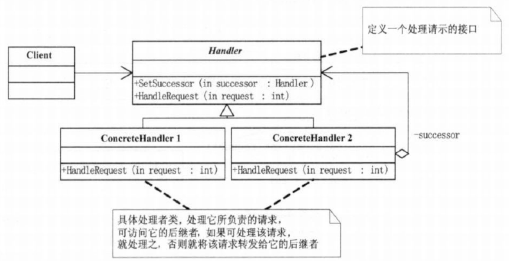
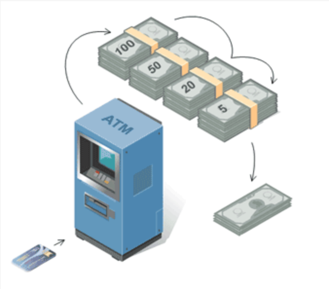

#责任链模式 Chain of Responsibility

##剖析
####意图

- 给多个对象处理请求，避免了接收请求的冗余。责任链接收对象并传递请求
- 面向对象与递归遍历链表

#### 定义

- 使用多个对象都有机会处理请求，从而避免请求的发送者和接受者之间的耦合关系。将这个对象连成一条链，并沿着这条链传递该请求，直到有一个对象处理它为止。

#### 本质

- 分离职责，动态组合
- 分离职责是前提，动态组合才是职责链模式的精华所在

#### 模式讲解
- - 在标准的职责链模式中，只要有对象处理了请求，这个请求就到此为止，不在被传递和处理了
- 客户端发送请求，总有一个隐式接收者处理请求

- 按照实现地方：
在实现客户端提交请求钱组合链。
可以再Handler里面实现链的组合，算是内部链的一种
还有一种在各自的职责对象中，由各个职责对象自行决定后续处理对象。这种实现方式要求每个职责对象除了进行业务处理外，还必须了解整个业务流程
数据来源：
一种在程序中动态组合
通过外部
通过配置文件传递进来，流程的配置文件
按照设定好的条件来判断请求对象

- 在责任链模式中，请求不一定处理，因为可能没有合适的处理者，请求在责任链中从头到尾，每个处理对象都判断都不属于自己处理，最后请求就没有对象来处理

##UML

#### 模式组成

- Handler:定义职责的接口，通常在这里定义处理请求的方法，可以再这里实现后继链
- ConcreteHandler: 实现职责的类，在这个类中，实现对他职责范围内请求的处理，如果不处理，就继续转发请求给后继者
- Client:职责链的客户端，向链上的具体处理对象提交请求，让职责链负责处理

***抽象处理类***：抽象处理类中主要包含一个指向下一处理类的成员变量nextHandler和一个处理请求的方法handRequest，handRequest方法的主要主要思想是，如果满足处理的条件，则有本处理类来进行处理，否则由nextHandler来处理。
*** 具体处理类***：具体处理类主要是对具体的处理逻辑和处理的适用条件进行实现。

####抽象类实现三个职责：

- 定义一个请求处理方法handleMessage  唯一对外开放的方法
- 定义一个链的编排方法setNext 设置下一个处理者；
- 定义了具体的请求者必须实现两个方法：定义自己能够处理的级别getHandlerLevel和具体的处理任务scho

##例子

##场景
- 有多个对象可以处理请求，而处理程序只有在运行时才能确定。
- 向一组对象发生请求，而不想显示指定处理请求的特定处理程序。
- 想要动态制定处理一个请求的对象集合，可以使用职责链模式。

##优缺点
####优点

- 请求者和接收者松散耦合
- 动态组合职责

####缺点

- 产生许多细粒度对象
- 不一定能背处理
- 性能问题
- 调试不方便

##总结
- 责任链模式其实就是一个灵活版的if…else…语句，它就是将这些判定条件的语句放到了各个处理类中，这样做的优点是比较灵活了，但同样也带来了风险，比如设置处理类前后关系时，一定要特别仔细，搞对处理类前后逻辑的条件判断关系，并且注意不要在链中出现循环引用的问题。

