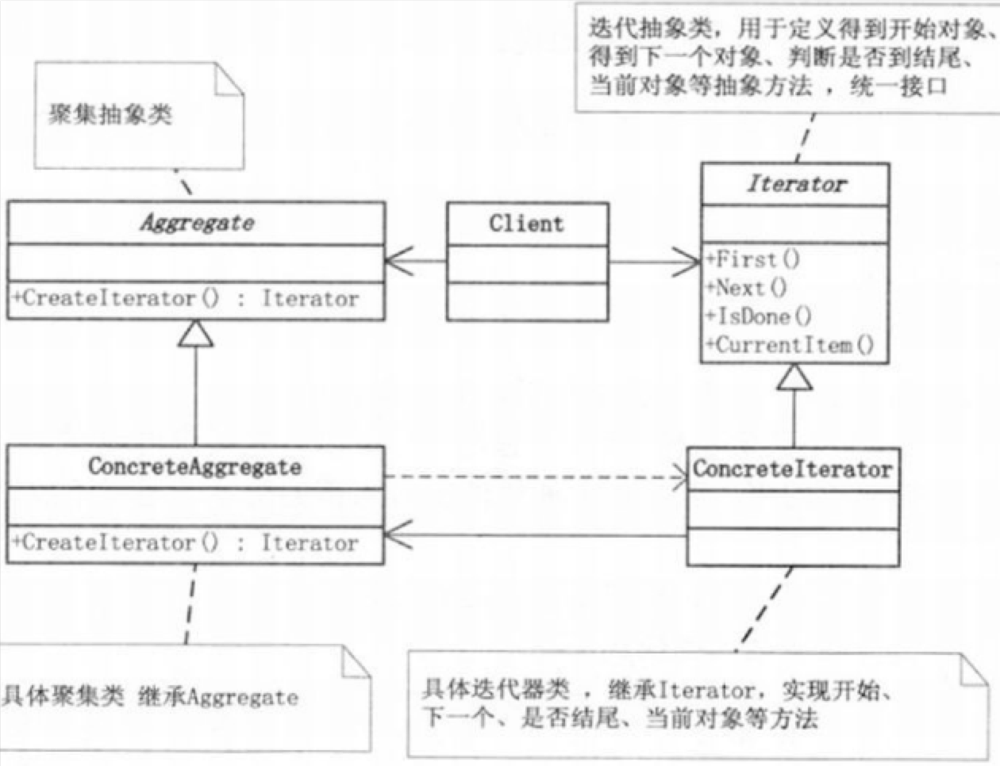
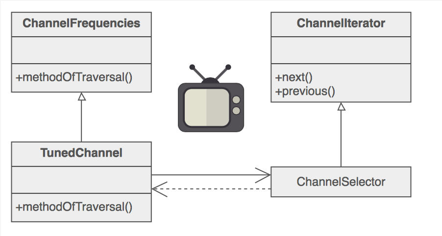

#迭代器模式Iterator

##背景
###概述

类中的面向对象编程封装应用逻辑。类，就是实例化的对象，每个单独的对象都有一个特定的身份和状态。单独的对象是一种组织代码的有用方法，但通常你会处理一组对象或者集合。

集合不一定是均一的。图形用户界面框架中的 Window 对象可以收集任意数量的控制对象 － Menu、Slider 和 Button。并且，集合的实现可以有多种方式：PHP 数字是一个集合，但也是一个散列表，一个链接列表，一个堆栈以及队列。

###问题

如何操纵任意的对象集合？
如一个列表(List)或者一个集合(Set)，我们又如何提供一种方法来让别人可以访问它的元素，而又不需要暴露它的内部结构？

###解决方案

迭代器模式：使用迭代器模式来提供对聚合对象的统一存取，即提供一个外部的迭代器来对聚合对象进行访问和遍历 , 而又不需暴露该对象的内部结构。又叫做游标（Cursor）模式 。
你可能没有意识到这一点，但你每天都在使用迭代器模式 。

##剖析
###意图

- 在没有公开其底层表示时，提供一种顺序访问聚合对象元素的方法
- C++和java 标准抽象库解耦集合类和算法
- 提供 “full object status”  遍历集合类
- 多态的遍历

###定义

- 提供一种方法顺序访问一个聚合对象中的各个元素，而又不需要暴露该对象的内部表示

###本质

- 控制访问聚合对象中的元素

##UML

###模式组成

- 抽象迭代器(Iterator): 迭代器定义访问和遍历元素的接口。
- 具体迭代器(ConcreteIterator):  具体迭代器实现迭代器Iterator接口。对该聚合遍历时跟踪当前位置。
- 抽象聚合类(Aggregate): 聚合定义创建相应迭代器对象的接口。
- 具体聚合类(ConcreteAggregate): 体聚合实现创建相应迭代器的接口，该操作返回ConcreteIterator的一个适当的实例。

###分类
外部迭代器：让客户端直接操作迭代过程，所以客户端需要知道外部迭代器才能使用。

内部迭代器：集合对象在其内部维护并操作一个外部迭代器。提供内部迭代器的典型的集合对象为客户端定义一个接口，或者从底层的集合一次访问一个元素，或者向每一个元素发送消息。外部迭代器与内部迭代器的区别：

外部迭代器：

客户端需要知道外部迭代器才能使用，但是他为客户端提供了更多的控制。客户端创建并维护了更多的控制客户端可以使用不同外部迭代器实现多种类型的遍历。

内部迭代器：

客户端不需要知道任何外部迭代器，而是可以通过集合对象的特殊接口，或者向集合中的每一个元素发送消息。

集合对象本身创建并维护它的外部迭代器

集合对象可以在不修改客户端的情况下，选择不同的外部迭代器。

##例子

##何时使用
- 需要访问组合对象的内容，而又不暴露其内部表示。
- 需要通过多种方式遍历组合对象。
- 需要提供一个统一的接口，用来遍历各种类型的组合对象。

##优缺点

###优点
- 1 ) 它支持以不同的方式遍历一个聚合对象 ： 复杂的聚合可用多种方式进行遍历。迭代器模式使得改变遍历算法变得很容易 : 仅需用一个不同的迭代器的实例代替原先的实例即可。你也可以自己定义迭代器的子类以支持新的遍历。
- 2) 迭代器简化了聚合的接口 有了迭代器的遍历接口，聚合本身就不再需要类似的遍历接口了。这样就简化了聚合的接口。
- 3) 在同一个聚合上可以有多个遍历 每个迭代器保持它自己的遍历状态。因此你可以同时进行多个遍历。
- 4）在迭代器模式中，增加新的聚合类和迭代器类都很方便，无须修改原有代码，满足“开闭原则”的要求。

###缺点
- 由于迭代器模式将存储数据和遍历数据的职责分离，增加新的聚合类需要对应增加新的迭代器类，类的个数成对增加，这在一定程度上增加了系统的复杂性。

##总结
- 1）聚合是一个管理和组织数据对象的数据结构。
- 2）聚合对象主要拥有两个职责：一是存储内部数据；二是遍历内部数据。
- 3）存储数据是聚合对象最基本的职责。
- 4）将遍历聚合对象中数据的行为提取出来，封装到一个迭代器中，通过专门的迭代器来遍历聚合对象的内部数据，这就是迭代器模式的本质。迭代器模式是“单一职责原则”的完美体现。

###经验法则
- 解释器模式抽象点语法树是组合模式(因此 迭代器 和访问者模式很使用)
- 迭代器模式遍历整个组合;访问者模式应用在组合操作上
- 多态的迭代器依赖工厂方法子类化适当 的迭代器
- 备忘录通常和迭代器模式一起使用。迭代器模式使用备忘录捕获迭代器的状态。迭代器内部存储备忘录。