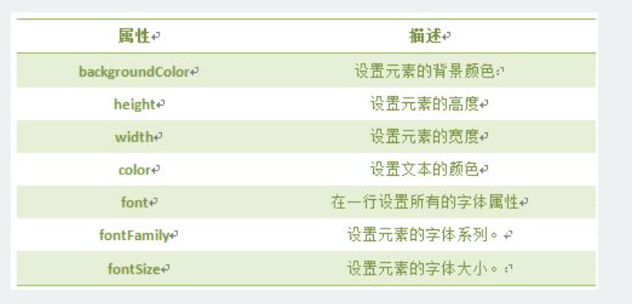

#JS

###JS插入位置

1.hrml内部引用
<pre>
		 <+script type="text/javascript"> </+script>
</pre>
2.html外部引用
<pre>
		<+script src="script.js"></+script>
</pre>
3.html位置 

将JavaScript代码放在html文件中任何位置，但是我们一般放在网页的head或者body部分。 
***放在<+head>部分*** 
最常用的方式是在页面中head部分放置<+script>元素，浏览器解析head部分就会执行这个代码，然后才解析页面的其余部分。 
***放在<+body>部分*** 
JavaScript代码在网页读取到该语句的时候就会执行。 

3.Note 
注意: javascript作为一种脚本语言可以放在html页面中任何位置，但是浏览器解释html时是按先后顺序的，所以前面的script就先被执行。比如进行页面显示初始化的js必须放在head里面，因为初始化都要求提前进行（如给页面body设置css等）；而如果是通过事件调用执行的function那么对位置没什么要求的。

###DOM
文档对象模型DOM（Document Object Model）定义访问和处理HTML文档的标准方法。DOM 将HTML文档呈现为带有元素、属性和文本的树结构（节点树）。
HTML文档可以说由节点构成的集合，三种常见的DOM节点:

1. 元素节点：上图中<html>、<body>、
等都是元素节点，即标签。

2. 文本节点:向用户展示的内容，如<li>...</li>中的JavaScript、DOM、CSS等文本。

3. 属性节点:元素属性，如<a>标签的链接属性href="http://www.imooc.com"。

###通过ID获取元素
document.getElementById(“id”) 

###innerHTML 属性
语法:

Object.innerHTML
注意:

1.Object是获取的元素对象，如通过document.getElementById("ID")获取的元素。

HTML DOM 允许 JavaScript 改变 HTML 元素的样式。如何改变 HTML 元素的样式呢？

语法:

Object.style.property=new style;
注意:Object是获取的元素对象，如通过document.getElementById("id")获取的元素。

基本属性表（property）:

注意:该表只是一小部分CSS样式属性，其它样式也可以通过该方法设置和修改。

***

***

###显示和隐藏（display属性）
网页中经常会看到显示和隐藏的效果，可通过display属性来设置。

语法：

Object.style.display = value
注意:Object是获取的元素对象，如通过document.getElementById("id")获取的元素。

###控制类名
className 属性设置或返回元素的class 属性。

语法：

object.className = classname
作用:

1.获取元素的class 属性

2. 为网页内的某个元素指定一个css样式来更改该元素的外观