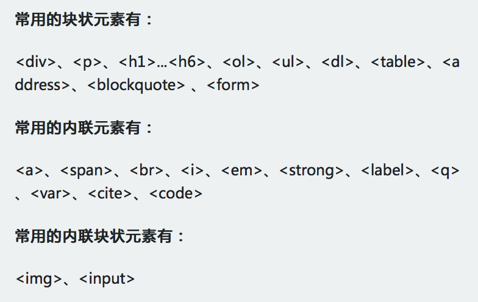
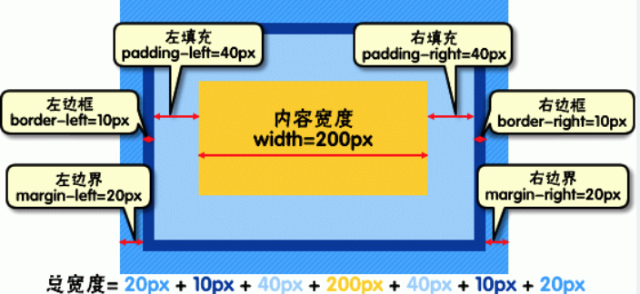
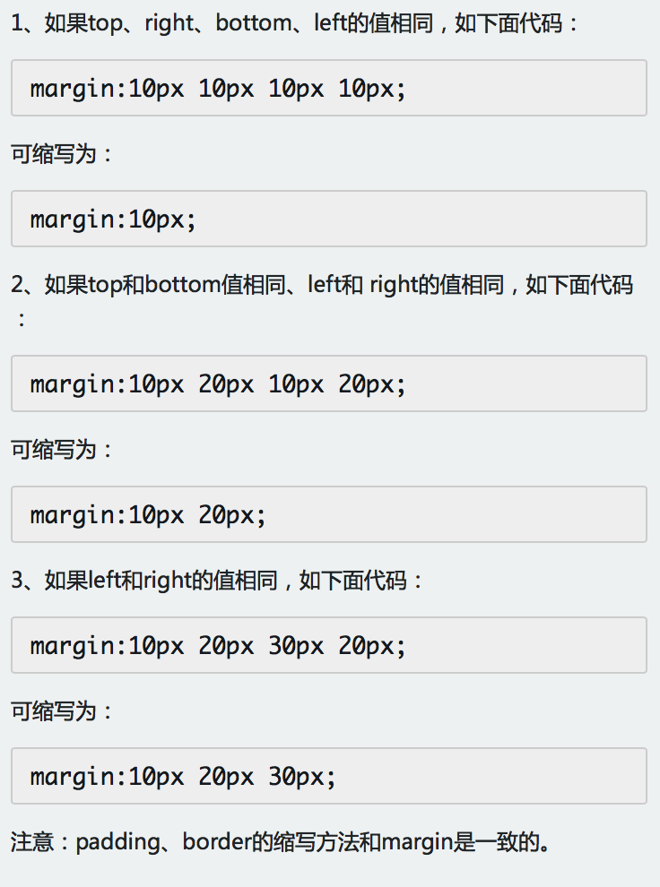
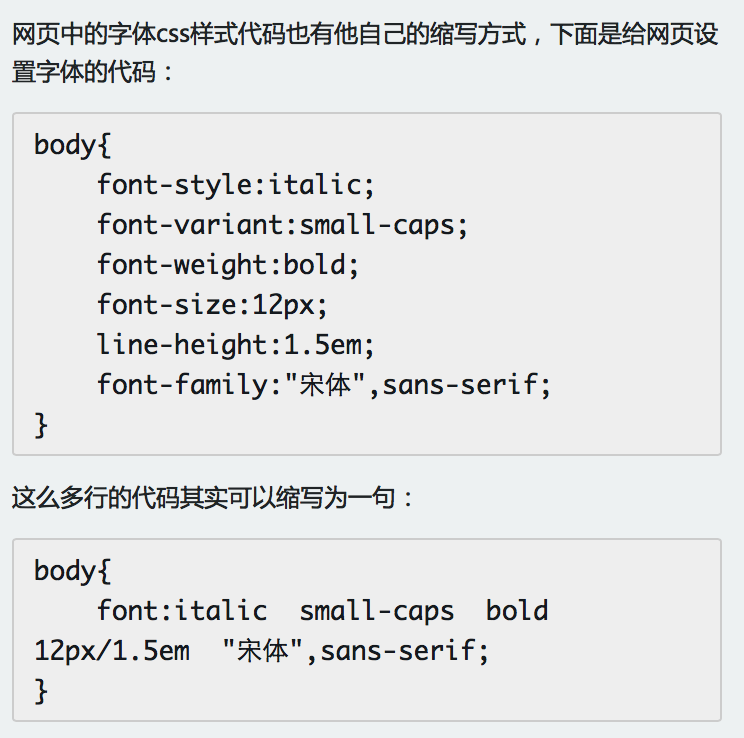

#css 全称为“层叠样式表”

Cascading Style sheet

页面中的表现

###属性值语法

- margin : length percentage  auto {1,4}

基本元素  组合符号  数量符号

- 组合符号

空格   &&  ||  |  【】 +  {}

###组成：

选择器 {
	属性：值；声明
}

注释/* */

###分类：三种

***内联式*** 
css样式表就是把css代码直接写在现有的HTML标签中

***嵌入式***  
可以把css样式代码写在标签之间。
      一般情况下嵌入式css样式写在<head></head>之间。

***外部式***  
css代码写一个单独的外部文件中，这个css样式文件以“.css”为扩展名，
		在“head”内（不是在style标签内）使用link标签将css样式文件链接到HTML文件内，如下面代码： 
	<link href="base.css引用位置" rel="stylesheet" type="text/css" />

***优先级***:在的相同权值的情况下，内联式 > 嵌入式 > 外部式；
	   嵌入式>外部式有一个前提：嵌入式css样式的位置一定在外部式的后面。
       其实总结来说，就是--就近原则（离被设置元素越近优先级别越高）。

###浏览器私有属性

- chrome,safari -webkit-
- firefox       -moz-
- IE            -ms-
- opera         -o-

###不同选择器：

####1.标签选择器
html代码中的标签。

####2.类选择器
.类选择器{}
使用 class = "类选择器名称" 为标签设置一个类

####3.id选择器
 方式： #选择器{	}为标签设置id="ID名称"

***class  和 id 选择器的区别*** 
相同点：可以应用于任何元素 
不同点： 
1、ID选择器只能在文档中使用一次。与类选择器不同，在一个HTML文档中，ID选择器只能使用一次，
而且仅一次。而类选择器可以使用多次。 
2.可以使用类选择器词列表方法为一个元素同时设置多个样式。
我们可以为一个元素同时设多个样式，但只可以用类选择器的方法实现。ID选择器是不可以的（不能使用 ID 词列表）。比如：  
     （span class="stress bigsize"）

####4.子选择器
大于符号(>),用于选择指定标签元素的第一代子元素
.first > span{color:red;}
####5.包含(后代)选择器
即加入空格,用于选择指定标签元素下的后辈元素。如：.first  span{color:red;}

***比较*** 
子选择器（child selector）仅是指它的直接后代，或者你可以理解为作用于子元素的第一代后代。
而后代选择器是作用于所有子后代元素。后代选择器通过空格来进行选择，而子选择器是通过“>”进行选择。 
***总结***：>作用于元素的第一代后代，空格作用于元素的所有后代。

====
####5.通用选择器
通用选择器是功能最强大的选择器，它使用一个（*）号指定，它的作用是匹配html中所有标签元素

####6.伪类选择符
它允许给html不存在的标签（标签的某种状态）设置样式 
link 未访问（默认） -- hover  鼠标悬停（鼠标划过） -- active 链接激活（鼠标按下） -- visited 访问过后（点击过后） 
顺序：link visited hover active 
a:hover{color:red;}

####7.分组选择符
多个标签元素设置同一个样式时，可以使用分组选择符（，）
h1,span{color:red;}

###特性：

####1.继承
CSS的某些样式是具有继承性的；继承是一种规则，它允许样式不仅应用于某个特定html标签元素，而且应用于其后代。

####2.特殊性：
有的时候我们为同一个元素设置了不同的CSS样式代码，那么元素会启用哪一个CSS样式呢？ 
下面是权值的规则： 
标签的权值为1，类选择符的权值为10，ID选择符的权值最高为100。
注意：还有一个权值比较特殊--继承也有权值但很低，有的文献提出它只有0.1，所以可以理解为继承的权值最低。

####3.层叠：
如果在html文件中对于同一个元素可以有多个css样式存在并且这多个css样式具有相同权重值怎么办？ 
层叠就是在html文件中对于同一个元素可以有多个css样式存在，当有相同权重的样式存在时， 
会根据这些css样式的前后顺序来决定，处于最后面的css样式会被应用。 
所以内联样式表（标签内部）> 嵌入样式表（当前文件中）> 外部样式表（外部文件中）。 

####4.重要性：
我们在做网页代码的时，有些特殊的情况需要为某些样式设置具有最高权值，怎么办？ 
这时候我们可以使用!important来解决。 
p{color:red!important;} //注意：!important要写在分号的前面

###格式化排版
#####1.字体
font-family; 
color 
font-weight:bold;//粗体 
font-style:italic; //斜体 
text-decoration:underline;//下划线 
text-decoration:line-through;//删除线 

####2.段落排版
text-indent:2em;//缩进--注意：2em的意思就是文字的2倍大小。 
line-height:1.5em; //行间距--（行高） 
letter-spacing://中文字间隔、字母间隔设置;字母与字母 
word-spacing://单词间距设置 
text-align; //对齐

###元素分类
***块元素*** 
设置display:block就是将元素显示为块级元素。 换行显示
块级元素特点： 
1、每个块级元素都从新的一行开始，并且其后的元素也另起一行。（真霸道，一个块级元素独占一行） 
2、元素的高度、宽度、行高以及顶和底边距都可设置。 
3、元素宽度在不设置的情况下，是它本身父容器的100%（和父元素的宽度一致），除非设定一个宽度。 
***内联元素*** 
块状元素也可以通过代码display:inline将元素设置为内联元素 
默认宽度为内容宽度，不可设置宽高，同行显示
内联元素特点： 
1、和其他元素都在一行上； 
2、元素的高度、宽度及顶部和底部边距不可设置； 
3、元素的宽度就是它包含的文字或图片的宽度，不可改变。 
***内联块元素*** 
内联块状元素（inline-block）就是同时具备内联元素、块状元素的特点，代码display:inline-block就是将元素设置为内联块状元素。 
inline-block 元素特点： 
1、和其他元素都在一行上； 
2、元素的高度、宽度、行高以及顶和底边距都可设置。 

display:none 设置元素不显示
visibility:hidden  依然暂居位置

#####水平居中
margin:0 auto

###盒模型

#####什么是盒子模型
打个比喻：中秋节送包装月饼，里面每一个月饼等同于div,月饼距离包装称为padding,月饼与月饼之间距离称为marg,月饼包装为bording; 
note： 
内填充，外边距，边框都有四个方向 
####边框
盒子模型的边框就是围绕着内容及补白的线，这条线你可以设置它的粗细、样式和颜色(边框三个属性)。

***写法*** 
div{
    border:2px  solid  red;
} 

or 

div{
    border-width:2px;
    border-style:solid;
    border-color:red;
} 
提供单边设置下边框

注意： 
1、border-style（边框样式）常见样式有： 
dashed（虚线）| dotted（点线）| solid（实线）。 

2、border-color（边框颜色）中的颜色可设置为十六进制颜色，如: 
border-color:#888;//前面的井号不要忘掉。 

3、border-width（边框宽度）中的宽度也可以设置为： 
thin | medium | thick（但不是很常用），最常还是用象素（px）。 

####宽度和高度
盒模型宽度和高度和我们平常所说的物体的宽度和高度理解是不一样的，css内定义的宽（width）和高（height），指的是填充以里的***内容范围***。 
因此一个元素实际宽度（盒子的宽度）=左边界+左边框+左填充+内容宽度+右填充+右边框+右边界。元素的高度也是同理。

####填充
元素内容与边框之间是可以设置距离的，称之为“填充”；
填充也可分为上、右、下、左(顺时针)。
####边界
元素与其它元素之间的距离可以使用边界（margin）来设置。边界也是可分为上、右、下、左。 
div{margin:20px 10px 15px 30px;} 
也可以分开写： 

div{
   margin-top:20px;
   margin-right:10px;
   margin-bottom:15px;
   margin-left:30px;
} 
如果上右下左的边界都为10px;可以这么写： 

div{ margin:10px;} 
如果上下边界一样为10px，左右一样为20px，可以这么写： 

div{ margin:10px 20px;} 

##Overflow

1.visible
2.hidden
3.scroll
4.auto

##box-sizing

box-sizing: content-box | boder-box | inherit

box-shadow
outline

###布局模型
布局模型是建立在盒模型基础之上，又不同于我们常说的 CSS 布局样式或 CSS 布局模板。如果说布局模型是本，那么 CSS 布局模板就是末了，是外在的表现形式。  

CSS包含3种基本的布局模型，用英文概括为：Flow、Layer 和 Float。 

在网页中，元素有三种布局模型： 

1、***流动模型（Flow）*** 

流动（Flow）是默认的网页布局模式。也就是说网页在默认状态下的 HTML 网页元素都是根据流动模型来分布网页内容的。 
第一点，块状元素都会在所处的包含元素内自上而下按顺序垂直延伸分布，因为在默认状态下，块状元素的宽度都为100%。实际上，块状元素都会以行的形式占据位置。 
第二点，在流动模型下，内联元素都会在所处的包含元素内从左到右水平分布显示。（内联元素可不像块状元素这么霸道独占一行）

----updte 0526
标准文档流

2、***浮动模型 (Float)*** 

让两个块状元素并排显示;任何元素在默认情况下是不能浮动的，但可以用 CSS 定义为浮动
float:left or right | none | inhert; 

默认宽度为内容宽度，脱离文档流 ，向指定方向一直移动

float元素在同一文档流
float元素半脱离文档流

clear: both | left | right | none | inherit
应用于后续元素  
应用于块级元素

- 空白元素
- clearfix

3、***层模型（Layer）*** 
层布局模型就像是图像软件PhotoShop中非常流行的图层编辑功能一样，每个图层能够精确定位操作，但在网页设计领域，由于网页大小的活动性，层布局没能受到热捧。但是在网页上局部使用层布局还是有其方便之处的。 
***层模型有三种形式***： 

position  设置 定位方式
top right bottom left z-index  设置位置

z-index 栈

0 默认为static

1、***绝对定位***(position: absolute) 

设置position:absolute(表示绝对定位);这条语句的作用将元素从文档流中拖出来，然后使用left、right、top、bottom属性相对于其最接近的一个***具有定位属性的父包含块***进行绝对定位。如果不存在这样的包含块，则相对于body元素，即相对于浏览器窗口。 

指非static 第一个祖先元素
 z-index 层级关系
 
 默认宽度为内容宽度
 脱离文档流
 参照物第一个定位祖先或根元素

2、***相对定位***(position: relative)

通过left、right、top、bottom属性确定元素在正常文档流中的偏移位置。相对定位完成的过程是首先按static(float)方式生成一个元素(并且元素像层一样浮动了起来)，然后相对于以前的位置移动，移动的方向和幅度由left、right、top、bottom属性确定，***偏移前的位置保留不动***。

仍在文档流中，参照物为元素本身

3、***固定定位***(position: fixed)

fixed：表示固定定位，与absolute定位类型类似，但它的相对移动的坐标是视图（屏幕内的网页窗口）本身。由于视图本身是固定的，它不会随浏览器窗口的滚动条滚动而变化，除非你在屏幕中移动浏览器窗口的屏幕位置，或改变浏览器窗口的显示大小，因此固定定位的元素会始终位于浏览器窗口内视图的某个位置，不会受文档流动影响，这与background-attachment:fixed;属性功能相同。

默认为内容宽度
脱离文档流
参照物为视窗

4.默认值

5.inherit从父元素继承

###FLEX布局
flex container
flex item
创建flex container

display: flex
在文档流中的子元素

方向：

- flex-direction: row| row-reverse| column| column-reverse
- flex-wrap:nowarap | wrap | wrap-reverse  //换行
- flex-flow: <'flex-direction'> || <'flex-wrap'>
- order:<interger>  initial:0

弹性：
- flex-basis : main-size | <width>  设置flex item的初始化宽高
- flex-grow: <number>    initial:0  空余空间比例
- flex-shrink :<number>  initial:1

flex； grow | shrink | basis

###对齐

- justify-content: flex-start | flex-end | center | space-between | space-around

设置main-axis方向上的对齐方式,剩余空间如何分配

- align-items  垂直方向
 align-items: flex-start | flex-end | center | baseline | stretch

- align-self : auto | flex-start | flex-end |center | baseline | stretch

设置单个flex item 在cross-axis方向上对齐方式

- align-content：flex-start | flex-end | center | space-between | space-around

###缩写

####盒模型代码简写
盒模型时外边距(margin)、内边距(padding)和边框(border)设置上下左右四个方向的边距是按照顺时针方向设置的：上右下左。

#####颜色缩写
关于颜色的css样式也是可以缩写的，当你设置的颜色是16进制的色彩值时，如果每两位的值相同，可以缩写一半。
####字体缩写

***注意：***

1、使用这一简写方式你至少要指定 font-size 和 font-family 属性，其他的属性(如 font-weight、font-style、font-varient、line-height)如未指定将自动使用默认值。

2、在缩写时 font-size 与 line-height 中间要加入“/”斜扛。 

一般情况下因为对于中文网站，英文还是比较少的，所以下面缩写代码比较常用： 

body{
    font:12px/1.5em  "宋体",sans-serif;
} 
只是有字号、行间距、中文字体、英文字体设置。 

###单位与值

####颜色
在网页中的颜色设置是非常重要，有字体颜色（color）、背景颜色（background-color）、边框颜色（border）等，设置颜色的方法也有很多种： 
1、英文命令颜色p{color:red;}
2、RGB颜色p{color:rgb(133,45,200);}
3.十六进制颜色其原理其实也是 RGB 设置，但是其每一项的值由 0-255 变成了十六进制 00-ff。p{color:#00ffff;}

####长度值
***1.像素***  
***2.em*** 本元素给定字体的 font-size 值，如果元素的 font-size 为 14px ，那么 1em = 14px；如果 font-size 为 18px，那么 1em = 18px。 
下面注意一个特殊情况：
但当给 font-size 设置单位为 em 时，此时计算的标准以 p 的父元素的 font-size 为基础。 
***3、百分比*** 
p{font-size:12px;line-height:130%}
设置行高（行间距）为字体的130%（12 * 1.3 = 15.6px）。

###技巧
####水平居中
inine-block  + text-align
table + margin
absolute + transform  不会对其他元素产生影响    兼容性差一些
 flex + justify-content 设置 parent节点  

***1.行内元素*** 
如果被设置元素为文本、图片等行内元素时，水平居中是通过给父元素设置 text-align:center 来实现的。
***2.块状定宽元素*** 
满足定宽和块状两个条件的元素是可以通过设置“左右margin”值为“auto”来实现居中的。
***3.块状不定宽元素*** 
不定宽度的块状元素有三种方法居中（这三种方法目前使用的都很多）： 

***3.1加入 table 标签*** 
***原理***：利用table标签的长度自适应性---即不定义其长度也不默认父元素body的长度（table其长度根据其内文本长度决定），因此可以看做一个定宽度块元素，然后再利用定宽度块状居中的margin的方法，使其水平居中。
***步骤***：第一步：为需要设置的居中的元素外面加入一个 table 标签 ( 包括 <tbody>、<tr>、<td> )。

第二步：为这个 table 设置“左右 margin 居中”（这个和定宽块状元素的方法一样）。
***3.2设置 display: inline 方法：与第一种类似，显示类型设为 行内元素，进行不定宽元素的属性设置*** 
改变块级元素的 display 为 inline 类型（设置为 行内元素 显示），然后使用 text-align:center 来实现居中效果。 
存在着一些问题：它将块状元素的 display 类型改为 inline，变成了行内元素，所以少了一些功能，比如设定长度值。 
***3.3设置 position:relative 和 left:50%：利用 相对定位 的方式，将元素向左偏移 50% ，即达到居中的目的*** 
通过给父元素设置 float，然后给父元素设置 position:relative 和 left:50%，子元素设置 position:relative 和 left: -50% 来实现水平居中。

***理解：***假想ul层的父层（即下面例子中的div层）中间有条平分线将ul层的父层（div层）平均分为两份，ul层的css代码是将ul层的最左端与ul层的父层（div层）的平分线对齐；而li层的css代码则是将li层的平分线与ul层的最左端（也是div层的平分线）对齐，从而实现li层的居中。

####垂直居中

- table-cell + vertical-align
- absolute + transform
- flex + align-items
- 

***1.父元素高度确定的单行文本*** 

父元素高度确定的单行文本的竖直居中的方法是通过设置父元素的 height 和 line-height 高度一致来实现的。(height: 该元素的高度，line-height: 顾名思义，行高（行间距），指在文本中，行与行之间的 基线间的距离 )。 

line-height 与 font-size 的计算值之差，在 CSS 中成为“行间距”。分为两半，分别加到一个文本行内容的顶部和底部。 

这种文字行高与块高一致带来了一个弊端：当文字内容的长度大于块的宽时，就有内容脱离了块。 

***2.父元素高度确定的多行文本。***

***2.1使用插入 table  (包括tbody、tr、td)标签，同时设置 vertical-align：middle。***

css 中有一个用于竖直居中的属性 vertical-align，在父元素设置此样式时，会对inline-block类型的子元素都有用。

####居中

####隐式改变display
当为元素（不论之前是什么类型元素，display:none 除外）设置以下 2 个句之一：

 1. position : absolute 

 2. float : left 或 float:right 

简单来说，只要html代码中出现以上两句之一，元素的display显示类型就会自动变为以 display:inline-block（块状元素）的方式显示，当然就可以设置元素的 width 和 height 了，且默认宽度不占满父元素。

#####CSS实践原则
1、多行原则 -- 分多行编写
2.分层原则 --便于维护，结构清晰： HTML ，CSS ，JS-- 
		base层
		common层
		page层
3.职责原则 -- 保持独立，便于重用
4.封装原则 -- 页面之间不要相互影响
	加前缀
	加命名空间
	注意简写
5.组合原则 -- 不要一个标签写到底，组合多个标签
	组合优先于继承
	
6.权重原则 --分清优先级
外联文件 内联CSS html元素
class id  标签

#####布局
#######框架布局
#######表格布局
#######盒子模型
#######css3弹性布局(Flex布局)
#######css3多列布局
- 定宽与自适应

1 float + margin + (fix 辅助)

2. float + overflow

3.table

4. flex

- 不定宽与自适应

- 等分

- 等高
- 全屏布局

