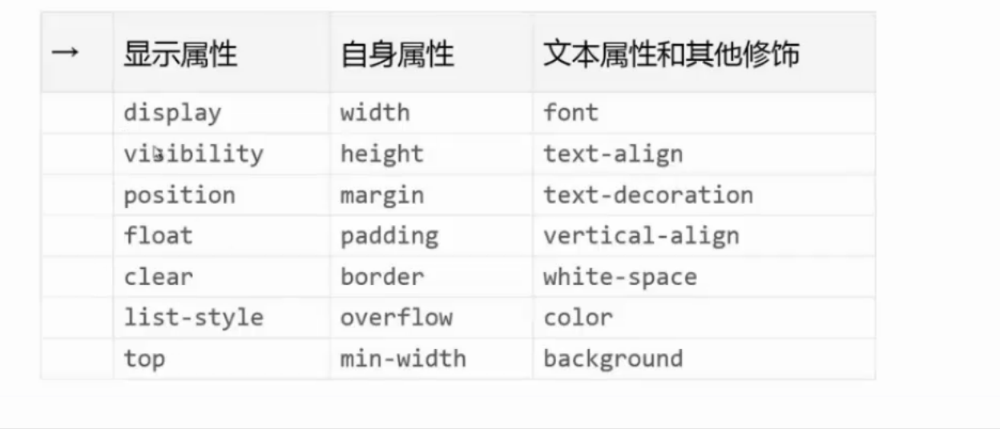

##规范

###文件规范

#### 文件分类
- 通用类
- 业务类
#### 文件引入

- 行内样式
- 外联引入
- 内联引入
- 避免在CSS中使用import

####文件本身

- 文件名
- 编码

###注释规范

####块状注释
- 统一缩进
- 在被注释对象之上

####单行注释

- 文件两端须空格
- 在被注释对象之上

####行内注释

- 文件两端须空格
- 在分号之后

###命名规范

####分类命名

####命名格式
- 大小写
- 长度
- 
####语义化命名

- 以内容语义命名
-

###书写规范

####单行与多行
####空格与分号
####属性顺序
####Hack方式
- 统一个浏览器Hack方式
- 不要滥用Hack

####值格式

- color
- url()

###其他规范

####HTML规范

- 文档声明
- 闭合  闭合标签 + 自闭和标签
- 属性 

- 层级
- 注释
- 大小写

####图片规范

- 文件名称  语义 + 产妇
- 保留原文件
- 图片合并  尽可能使用sprite技术 

