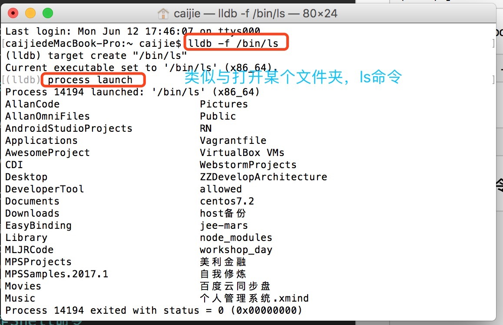

#LLDB  终端下进程链接

###一.进程已创建

在终端环境下，以Xcode为例

首先打开Xcode，运行终端，LLDB 链接XCode有如下方法：

第一种方式：
<pre>lldb -n Xcode</pre>

第二种方式：

<pre>pgrep -x Xcode</pre>  获取Xocde 的进程"XCode-PID"，然后 <pre>lldb -p  "XCode-PID" </pre>

###二.进程未创建

1.采用路径的方式 
<pre>
 lldb -f /Applications/Xcode.app/Contents/MacOS/Xcode 
</pre>
<pre>(lldb) process launch</pre>

2.链接正在调试的Xocde
<pre> lldb -n Xcode -w</pre>
新建终端tab
<pre>pkill Xcode</pre>

###三.绑定Shell命令

