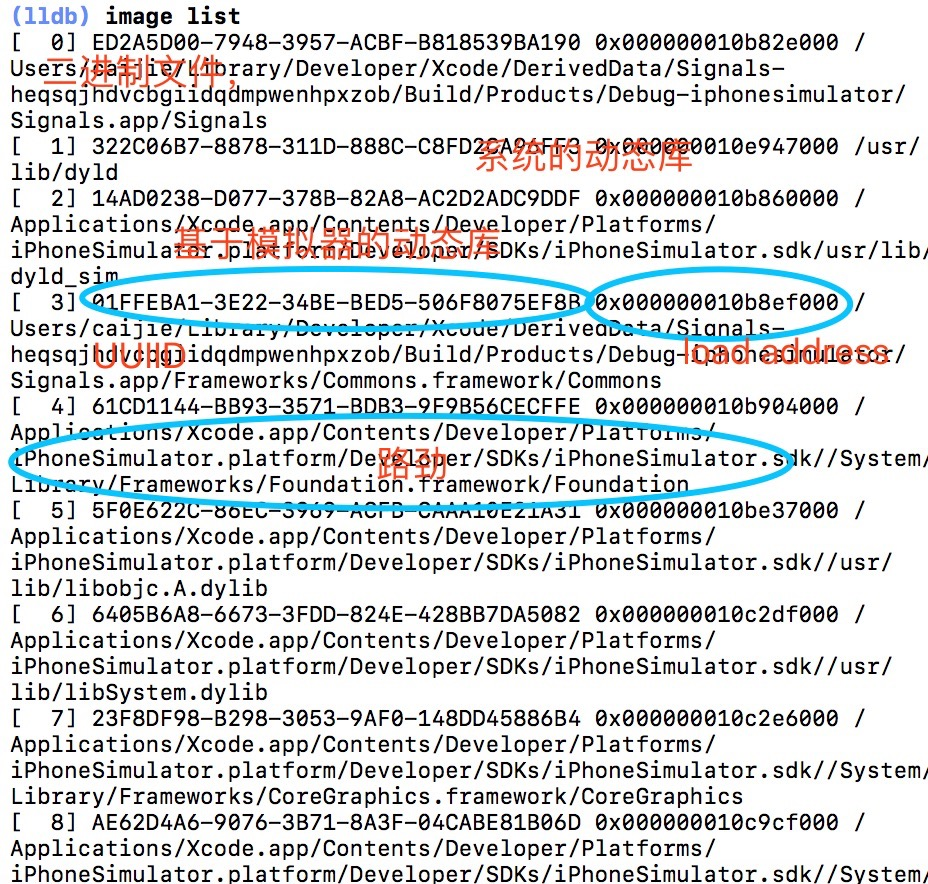

#LLDB image

##简介
image命令是target modules命令的别名. image是专门用来查询模块(modules)相关信息的; 更确切的说, 代码被加载到一个线程里面执行.模块可以包含许多事情, 包含主要的执行代码, 框架或者插件.然而, 大多数的模块都来自动态库.比如iOS的UIKit和macOS的AppKit都是常见的动态库.
image命令用来查询任何私有框架的信息和它里面没有在头文件里公开的类和方法都是非常有用的.

##相关命令
暂停调试器，列出当前加载的所有的模块
<pre>
(lldb) image list
</pre>
过滤加载模块，关注自己感兴趣的
<pre>
(lldb) image list Foundation
</pre>

如果想深入到某一模块，例如 UIKit
<pre>
(lldb) image dump symtab UIKit -s address
</pre>

过滤具体模块的信息，关注某一点
<pre>
(lldb) image lookup -n "-[UIViewController viewDidLoad]"
</pre>

也可以通过正则来判断
<pre>
(lldb) image lookup -rn UIViewController
</pre>
<pre>
(lldb) image lookup -rn '\[UIViewController\'(正则表达式)
</pre>

查看某一内存地址的内容
<pre>
(lldb) image lookup -a 0x000000010756d8a0
or
(lldb)po 0x0000618000070200
</pre>

##总结
1.用image dump symfile命令用来学习某种未知数据类型的好方法. 它还是用来学编译器是如何用你的源代码生成代码的好工具.
2.image lookup命令可以寻找私有方法以及公有方法

