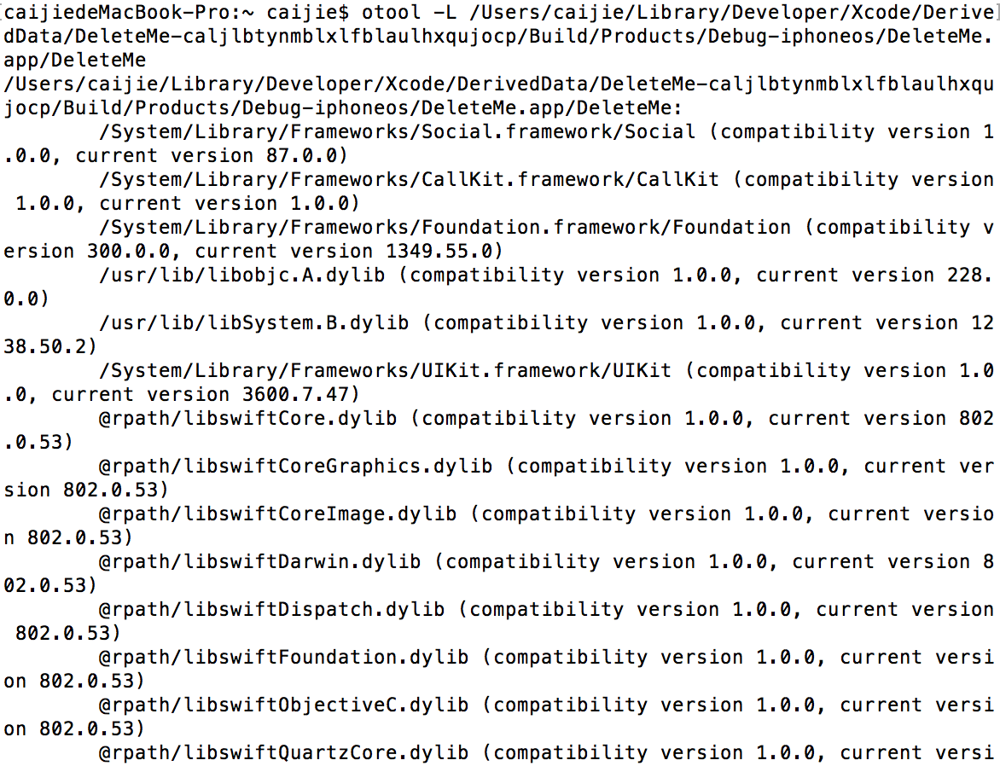
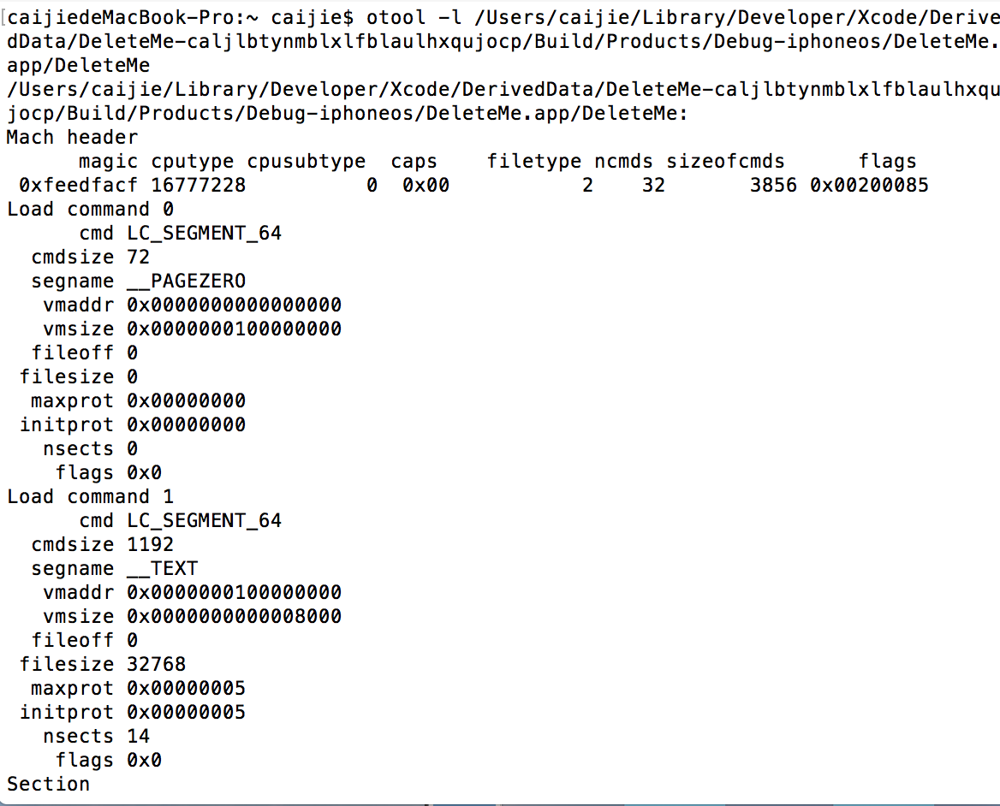
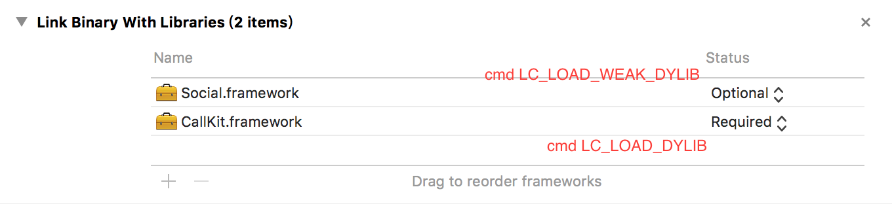

#动态framework

##优点
	1.加载时机：运行时，非编译时
	2.不需要重新编译执行便可以更新framework
	3.iOS8 放宽了动态库限制，在App里允许第三方动态库，目的为了iOS extensions共享
	
	
dyld:dynamic loader

##otool命令

<pre>
      otool -L  path(IPA 包内 项目的exec) 
      //你编译出的app使用otool命令，以便获得依赖哪些dylib的信息
      显示 系统库路径
      /System/Library/Frameworks
      /usr/lib/
      显示引用第三方库路径
      /usr/local/lib
</pre>

<pre>
      otool -l  path(IPA 包内 项目的exec)
      //用-l选项查看load commands：
</pre>

<pre>
 Optional framework  :  cmd LC_LOAD_WEAK_DYLIB
 
 Required framework  :  cmd LC_LOAD_DYLIB
 
Optional/Required 对于支持多版本iOS非常有益。
比如iOS最低版本支持iOS8 . iOS9 新出了新的framework 便可以选择为Optional
 
</pre>

##install_name_tool 
install_name_tool 是苹果提供的用来修改dylib安装名称的命令。
install_name_tool -change 

<pre>
动态加载库
(lldb) process load MessageUI.framework/MessageUI
打印出：
Loading "MessageUI.framework/MessageUI"...ok
Image 1 loaded.
</pre>

##自定义lldb命令分析framework
~/.lldbinit

<pre>
/*
 简化命令，分析某一framework
*/
command regex dump_stuff "s/(.+)/image lookup -rn '\+\[\w+(\(\w+\))?\ \w+\]$'%1/"
/*
    输出继承NSObject实例的所有变量
*/
command regex ivars 's/(.+)/expression -l objc -o -- [%1 _ivarDescription];/'
/*
    输出继承与NSObject实例所有的方法
*/
command regex methods 's/(.+)/expression -l objc -o --[%1 _shortMethodDescription]/'
/*
    输出继承与NSObject实例所有的方法包括他的父类 递归调用
*/
command regex lmethods 's/(.+)/expression -l objc -o --[%1  _methodDescription]/'

</pre>

##Actual iOS Device

1. framework 路径 /System/Library/Frameworks

##dlopen && dlsym 案例
<pre>
  static char * (*real_getenv)(const char *);
  
  static dispatch_once_t onceToken;
  
  dispatch_once(&onceToken, ^{
  
    handle = dlopen("/usr/lib/system/libsystem_c.dylib", RTLD_NOW);
    assert(handle);
    real_getenv = dlsym(handle, "getenv");
  });
</pre>
	