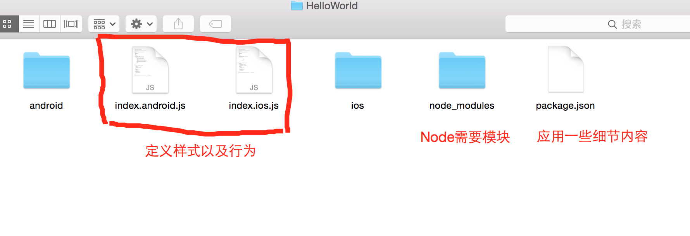

#ReactNative环境搭建

##1.配置

###1.1 Homebrew安装

Homebrew是OS X不可获取的套件管理器，我们可以通过它获取并且安装很多组件，安装方式： 

<pre>ruby -e "$(curl -fsSL https://raw.githubusercontent.com/Homebrew/install/master/install)"</pre>

最后通过命令执行  ***brew -v*** 查看Homebrew版本号。

###1.2 nvm && Node.js
管理多版本Note 
具体项目地址<https://github.com/creationix/nvm> 

安装方式：
<pre>
curl -o- https://raw.githubusercontent.com/creationix/nvm/v0.31.0/install.sh | bash
</pre>
另外需要在.bash_profile文件中配置环境变量，通过***nvm --version***查看版本 
安装Node.js
<pre>
nvm install node && nvm alias default node
</pre>
具体操作内容移步[这里](http://www.tuicool.com/articles/Vzquy2),介绍了npm多版本管理的方式 
***NOTE***如果现在采用是Node5.0版本的版本，官网是推荐安装npm 2，该版本比npm 3速度更加快。在安装完Node之后，命令行运行npm install  -g npm@2安装即可。

###1.3 watchman
该用于监控bug文件，并且可以触发指定的操作,安装方式如下
<pre>
sudo brew install watchman
</pre>

###1.4 flow
flow是一个 JavaScript 的静态类型检查器，建议安装它，以方便找出代码中可能存在的类型错误，官网:<http://www.flowtype.org/>
<pre>
sudo brew install flow
</pre>

***Note***
如果遇到错误，直接copy，百度，别问我为啥不用google.

###1.5 RN安装
<pre>
npm install -g react-native-cli
</pre>

#2.安装

###2.1初始化项目
初始化方式
<pre>
react-native init AwesomeProject
</pre>
生成的目录结构:

#3 RN开发环境IDE

####3.1 Atom & Nuclide
#####3.1.1 Atom
Atom 是由 Github 打造的下一代编程开发利器，支持 Windows、Mac OS X、Linux 三大桌面平台，免费且开源。Atom 支持各种编程语言的代码高亮，同时具备强大的代码补全功能，能够极大的提高编程效率，Atom 本质上是一个文本编辑器，而不是一个 IDE，因此在用来开发 React Native 时需要配合 Nuclide 一起使用。
点击这里下载<https://atom.io>
####3.1.2安装Nuclide
Nuclide 是 Facebook 基于 Atom 的基础上开发的一个插件 IDE，可以用来开发 React Native，iOS 和 Web 应用，目前不支持 Windows 平台，只支持 Mac OS X 和 Linux。直接打开Atom软件，点击Atom->Preferences打开Setting,然后点击install，输入nuclide-installer 搜索，进行下载即可

####3.2其他开发工具
Sublime Text 3
Webstorm
Deco
Visual Studio Code

####3.3抉择
如果你的团队都是使用 MacBook Pro 进行开发，那么上面五款 IDE 都可以使用，如果团队中既有 Windows 电脑，也有 Mac 电脑，那么 Atom ＋ Nuclide 和 Deco 就使用不了了。 

如果你们团队能够负担起付费应用，那么 WebStorm 是不错的选择，特别对于之前是 Android 开发的同学来说，可以实现 Android Studio 和 WebStorm 的无缝衔接。 

如果上面两个条件都不满足，那么就只剩下 Sublime Text 3 和 Visual Studio Code 可选了。从我们上面的介绍中可以了解到，这两款也都是非常强大的，如何选择取决于你自己。 

##参考内容
1.npm多版本管理<http://www.tuicool.com/articles/Vzquy2>
2.工具篇<http://mp.weixin.qq.com/s?__biz=MzA3ODg4MDk0Ng==&mid=2651112392&idx=1&sn=135e29ddde3050d469be98db815c267e&scene=0>
