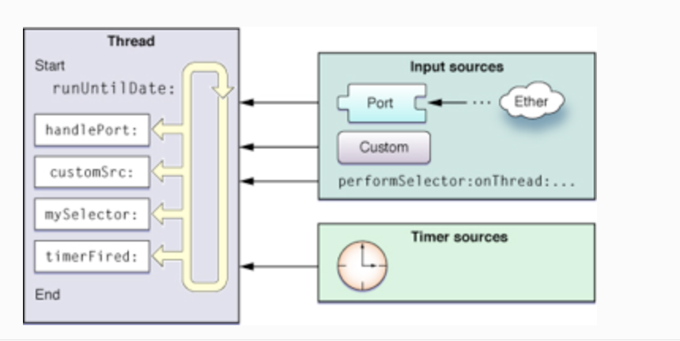

#iOS RunLoop进阶

  上一篇文章<从安卓的Looper到iOS RunLoop>谈论了安卓的Message，Handler和Looper  以及iOS RunLoop的理论概念，本篇文章着重探讨iOS RunLoop,主要讲解以下两个方面：
  *苹果系统RunLoop的影子
  *实际场景的应用
  
###RunLoop原理图

   一个run loop就是一个事件处理的循环，用来不停的调度工作以及处理输入事件。使用run loop的目的是让你的线程在有工作的时候忙于工作，而没工作的时候处于休眠状态。要有while或for循环语句来驱动run loop。在你的循环中，使用run loop object来运行事件处理代码，它响应接收到的事件并启动已经安装的处理程序。
   RunLoop 的核心是基于 mach port 的，其进入休眠时调用的函数是 mach_msg(),这里具体细节可以阅读系统开源源码来分析，这里不做分析。
   
   ***再次回顾下基础知识：*** 
   在Cocoa中，每个线程(NSThread)对象中内部都有一个run loop（NSRunLoop）对象用来循环处理输入事件。应用程序不需要显式的创建这些对象(run loop objects)；每个线程，包括程序的主线程都有与之对应的run loop object。只有辅助线程才需要显式的运行它的run loop。处理的事件包括两类，一是来自Input sources的异步事件，一是来自Timer sources的同步事件。  
每个run loop可运行在不同的模式下,一个run loop mode是一个集合，其中包含其监听的若干输入事件源，定时器等。运行在一种mode下的run loop只会处理其run loop mode中包含的输入源事件，定时器事件等。 Cocoa中的预定义模式有: 
1） Default模式。几乎包含了所有的输入源，一般情况下用此模式。 
2） Event tracking模式。user interface tracking loops时处于此种模式下，在此模式下会限制输入事件的处理。例如，当手指按住UITableView、UIScrollView拖动时就会处于此模式。 
3） Common模式 
为一组run loop mode的集合。在Cocoa应用程序中，默认情况下Common Modes包含default modes,modal modes,event Tracking modes。

***常用模式解读*** 
NSDefaultRunLoopMode：默认，空闲状态 
UITrackingRunLoopMode：ScrollView滑动时 
UIInitializationRunLoopMode：启动时 
NSRunLoopCommonModes：Mode集合 Timer计时会被scrollView的滑动影响的问题可以通过将timer添加到NSRunLoopCommonModes来解决 

###苹果系统RunLoop影子

####AutoreleasePool
   App启动后，，系统在主线程RunLoop 里注册两个Observser,其回调都是_wrapRunLoopWithAutoreleasePoolHandler()。 
   第一个 Observer 监视的事件是 Entry(即将进入Loop)，其回调内会调用 _objc_autoreleasePoolPush() 创建自动释放池。其优先级最高，保证创建释放池发生在其他所有回调之前。 
   第二个 Observer 监视了两个事件： BeforeWaiting(准备进入休眠) 时调用_objc_autoreleasePoolPop() 和 _objc_autoreleasePoolPush() 释放旧的池并创建新池；Exit(即将退出Loop) 时调用 _objc_autoreleasePoolPop() 来释放自动释放池。这个 Observer 优先级最低，保证其释放池子发生在其他所有回调之后。 
   在主线程执行的代码，通常是写在诸如事件回调、Timer回调内的。这些回调会被 RunLoop 创建好的 AutoreleasePool 环绕着，所以不会出现内存泄漏，开发者也不必显示创建 Pool 了。 
   ***
  *** 谈到这里，你就明白了以下两个问题：*** 
  1.autorelease何时释放？ 
   对于autorelease pool本身，会在如下两个条件发生时候被释放（详细信息请参见第5条）
在没有手加Autorelease Pool的情况下，Autorelease对象是在当前的runloop迭代结束时释放的，
而它能够释放的原因是系统在每个runloop迭代中都加入了自动释放池Push和Pop. 
1）手动释放Autorelease pool 
2）Runloop结束后自动释放 
***
  2.创建了新的线程,要放在AutoreleasePool中。每一个线程都会维护自己的 autoreleasepool 堆栈。换句话说 autoreleasepool 是与线程紧密相关的，每一个 autoreleasepool 只对应一个线程。
  ***
  
####iOS事件响应
  苹果注册了一个 Source1 (基于 mach port 的) 用来接收系统事件，其回调函数为 __IOHIDEventSystemClientQueueCallback()。 
  当一个硬件事件(触摸/锁屏/摇晃等)发生后，首先由 IOKit.framework 生成一个 IOHIDEvent 事件并由 SpringBoard 接收<http://iphonedevwiki.net/index.php/IOHIDFamily>。SpringBoard 只接收按键(锁屏/静音等)，触摸，加速，接近传感器等几种 Event，随后用 mach port 转发给需要的App进程。随后苹果注册的那个 Source1 就会触发回调，并调用 _UIApplicationHandleEventQueue() 进行应用内部的分发。 

_UIApplicationHandleEventQueue() 会把 IOHIDEvent 处理并包装成 UIEvent 进行处理或分发，其中包括识别 UIGesture/处理屏幕旋转/发送给 UIWindow 等。通常事件比如 UIButton 点击、touchesBegin/Move/End/Cancel 事件都是在这个回调中完成的。
***
####手势识别
当上面的 _UIApplicationHandleEventQueue() 识别了一个手势时，其首先会调用 Cancel 将当前的 touchesBegin/Move/End 系列回调打断。随后系统将对应的 UIGestureRecognizer 标记为待处理。

苹果注册了一个 Observer 监测 BeforeWaiting (Loop即将进入休眠) 事件，这个Observer的回调函数是 _UIGestureRecognizerUpdateObserver()，其内部会获取所有刚被标记为待处理的 GestureRecognizer，并执行GestureRecognizer的回调。

当有 UIGestureRecognizer 的变化(创建/销毁/状态改变)时，这个回调都会进行相应处理。
***
####界面刷新
当在操作 UI 时，比如改变了 Frame、更新了 UIView/CALayer 的层次时，或者手动调用了 UIView/CALayer 的 setNeedsLayout/setNeedsDisplay方法后，这个 UIView/CALayer 就被标记为待处理，并被提交到一个全局的容器去。

苹果注册了一个 Observer 监听 BeforeWaiting(即将进入休眠) 和 Exit (即将退出Loop) 事件，回调去执行函数里会遍历所有待处理的 UIView/CAlayer 以执行实际的绘制和调整，并更新 UI 界面。 
***友情思考*** 
 异步刷新
***
####iOS定时器
  NSTimer 其实就是 CFRunLoopTimerRef，他们之间是 toll-free bridged 的。一个 NSTimer 注册到 RunLoop 后，RunLoop 会为其重复的时间点注册好事件。RunLoop为了节省资源，并不会在非常准确的时间点回调这个Timer。 
  CADisplayLink 是一个和屏幕刷新率一致的定时器（但实际实现原理更复杂，和 NSTimer 并不一样，其内部实际是操作了一个 Source）。如果在两次屏幕刷新之间执行了一个长任务，那其中就会有一帧被跳过去（和 NSTimer 相似），造成界面卡顿的感觉。在快速滑动TableView时，即使一帧的卡顿也会让用户有所察觉。 
  ***友情提示**: 
  这里解释了以下几个问题： 
  1.为什么Timer时间不准确 
  2.CADisplayLink与Timer区别以及应用场景 
     CADisplayLink使用场合相对专一，适合做UI的不停重绘，比如自定义动画引擎或者视频播放的渲染。NSTimer的使用范围要广泛的多，各种需要单次或者循环定时处理的任务都可以使用。在UI相关的动画或者显示内容使用 CADisplayLink比起用NSTimer的好处就是我们不需要在格外关心屏幕的刷新频率了，因为它本身就是跟屏幕刷新同步的。 
  3.如何实现一个精确Timer。精确的Timer消耗更多的CPU循环和电量。一次性只能激活有限数量的高精准timer，当尝试使用太多的精准timer，所有的timer都丧失了准确性。
  <https://developer.apple.com/library/ios/technotes/tn2169/_index.html>
  ***
####NSObject-PerformSelecter

当调用 NSObject 的 performSelecter:afterDelay: 后，实际上其内部会创建一个 Timer 并添加到当前线程的 RunLoop 中。所以如果当前线程没有 RunLoop，则这个方法会失效。 

当调用 performSelector:onThread: 时，实际上其会创建一个 Timer 加到对应的线程去，同样的，如果对应线程没有 RunLoop 该方法也会失效。

***友情思考*** 
performSelector关于内存管理的执行原理是这样的执行 [self performSelector:@selector(method1:) withObject:self.tableLayer afterDelay:3]; 的时候，系统会将tableLayer的引用计数加1，执行完这个方法时，还会将tableLayer的引用计数减1，由于延迟这时tableLayer的引用计数没有减少到0，也就导致了切换场景dealloc方法没有被调用，出现了内存泄露。
利用如下函数：
[NSObject cancelPreviousPerformRequestsWithTarget:self]
当然你也可以一个一个得这样用：
[NSObject cancelPreviousPerformRequestsWithTarget:self selector:@selector(method1:) object:nil]
加上了这个以后，顺利地执行了dealloc方法
***
####GCD
当调用 dispatch_async(dispatch_get_main_queue(), block) 时，libDispatch 会向主线程的 RunLoop 发送消息，RunLoop会被唤醒，并从消息中取得这个 block，并在回调 __CFRUNLOOP_IS_SERVICING_THE_MAIN_DISPATCH_QUEUE__() 里执行这个 block。但这个逻辑仅限于 dispatch 到主线程，dispatch 到其他线程仍然是由 libDispatch 处理的。

***
####网络层
OS 中，关于网络请求的接口自下至上有如下几层:
CFSocket 
CFNetwork      ->ASIHttpRequest 
NSURLConnection ->AFNetworking 
NSURLSession    ->AFNetworking2, Alamofire 
介绍下 NSURLConnection 的工作过程。 

通常使用 NSURLConnection 时，你会传入一个 Delegate，当调用了 [connection start] 后，这个 Delegate 就会不停收到事件回调。实际上，start 这个函数的内部会会获取 CurrentRunLoop，然后在其中的 DefaultMode 添加了4个 Source0 (即需要手动触发的Source)。CFMultiplexerSource 是负责各种 Delegate 回调的，CFHTTPCookieStorage 是处理各种 Cookie 的。 

当开始网络传输时，我们可以看到 NSURLConnection 创建了两个新线程： com.apple.NSURLConnectionLoader 和 com.apple.CFSocket.private。其中 CFSocket 线程是处理底层 socket 连接的。NSURLConnectionLoader 这个线程内部会使用 RunLoop 来接收底层 socket 的事件，并通过之前添加的 Source0 通知到上层的 Delegate。 
NSURLConnectionLoader 中的 RunLoop 通过一些基于 mach port 的 Source 接收来自底层 CFSocket 的通知。当收到通知后，其会在合适的时机向 CFMultiplexerSource 等 Source0 发送通知，同时唤醒 Delegate 线程的 RunLoop 来让其处理这些通知。CFMultiplexerSource 会在 Delegate 线程的 RunLoop 对 Delegate 执行实际的回调。 
***友情提示：后头看看AF2.0 代码 找找RunLoop***
***
#实际场景的应用
####NSRunLoop常用方法
+ (NSRunLoop *)currentRunLoop; //获得当前线程的run loop

+ (NSRunLoop *)mainRunLoop; //获得主线程的run loop

- (void)run; //进入处理事件循环，如果没有事件则立刻返回。注意：主线程上调用这个方法会导致无法返回（进入无限循环，虽然不会阻塞主线程），因为主线程一般总是会有事件处理。

- (void)runUntilDate:(NSDate *)limitDate; //同run方法，增加超时参数limitDate，避免进入无限循环。使用在UI线程（亦即主线程）上，可以达到暂停的效果。

- (BOOL)runMode:(NSString *)mode beforeDate:(NSDate *)limitDate; //等待消息处理，好比在PC终端窗口上等待键盘输入。一旦有合适事件（mode相当于定义了事件的类型）被处理了，则立刻返回；类同run方法，如果没有事件处理也立刻返回；有否事件处理由返回布尔值判断。同样limitDate为超时参数。

- (void)acceptInputForMode:(NSString *)mode beforeDate:(NSDate *)limitDate; //似乎和runMode:差不多（测试过是这种结果，但确定是否有其它特殊情况下的不同），没有BOOL返回值。
####模拟轮询：可以阻塞线程，等待其他线程执行后再执行。

		 [NSThread detachNewThreadSelector:@selector(runOnNewThread) toTarget:self 		withObject:nil];    
  	    while (!end) {
        [[NSRunLoop currentRunLoop] runMode:NSDefaultRunLoopMode beforeDate:[NSDate 		distantFuture]];
        }
        ***
        -(void)runOnNewThread{
          sleep(1);
          //***在主线程更新end值***
             [self performSelectorOnMainThread:@selector(setEnd) withObject:nil      				waitUntilDone:NO];
         }
       -(void)setEnd{
          end=YES;
        }
或者你也可以使用：
  CFRunLoopStop(_currentLoop); 
  CFRunLoopRun(); 
  ****SDWebImage开源库用到***
  ***友情提示：CFRunLoop VS NSRunLoop*** 
  CFRunLoop属于线程安全的，而NSRunLoop不是。 
  如果停止NSRunLoop,使用runMode:beforeDate:. 
  <http://stackoverflow.com/questions/8590546/cfrunlooprun-vs-nsrunloop-run>
  
***
####RunLoop使用
######场景化
使用端口或自定义输入源来和其他线程通信 
使用线程的定时器 
Cocoa中使用任何performSelector...的方法 
使线程周期性工作 
######步骤
RunLoop使用分为以下四步骤，具体操作可以参考梦维<http://www.dreamingwish.com/article/ios-multithread-program-runloop-the.html> 
1获取RunLoop 
2配置RunLoop 
3.启动RunLoop 
4.退出RunLoop 
#参考文章
1.<http://www.cocoachina.com/ios/20150601/11970.html>
2.<http://iphonedevwiki.net/index.php/IOHIDFamily>
3.<http://www.dreamingwish.com/article/ios-multithread-program-runloop-the.html>
   