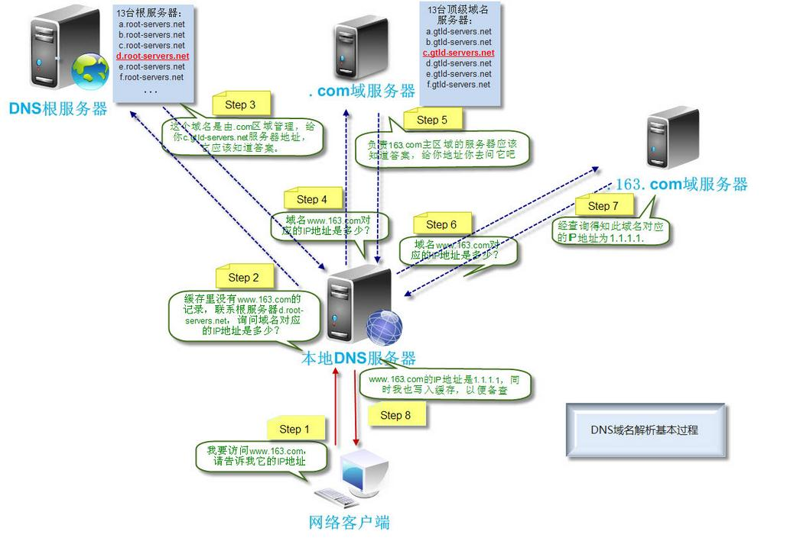

DNS

##什么是DNS
全称: Domain Name System(域名系统),是一种组织成域层次结构的计算机和网络服务命名***分布式数据库****，它用于TCP/IP网络，它所提供的服务是用来将主机名和域名转换为IP地址的工作,主要为了用户方便记忆。通过主机名，最终得到该主机名对应的IP地址的过程叫做域名解析（或主机名解析）。***DNS协议运行在UDP协议之上，使用端口号53。***

##DNS相关概念
 由一幅图来了解下DNS 层次相关术语:根域,顶级域,二级域,子域,主机名
 
 
##DNS解析过程

根据这幅图以www.baidu.com总结下流程:
总结一下便是
<pre>
         ①本机向local dns请求www.baidu.com
         ②local dns向根域请求www.baidu.com，根域返回com.域的服务器IP
         ③向com.域请求www.baidu.com，com.域返回baidu.com域的服务器IP
         ④向baidu.com请求www.baidu.com，返回cname www.a.shifen.com和a.shifen.com域的服务器IP
         ⑤向root域请求www.a.shifen.com
         ⑥向com.域请求www.a.shife.com
         ⑦向shifen.com请求
         ⑧向a.shifen.com域请求
         ⑨拿到www.a.shifen.com的IP
         ⑩localdns返回本机www.baidu.com cname www.a.shifen.com 以及 www.a.shifen.com的IP
</pre>

咱再来一张图,温习下

我们要知道DNS查询两个过程:***迭代查询和递归查询***:

第一，主机向本地域名服务器的查询一般都是采用递归查询（recursive query）。如果主机所查询的本地域名服务器不知道被查询域名的IP，那么本地域名服务器就以DNS客户端的身份，向其他的根域名服务器发出查询请求报文（即替代该主机继续查询），而不是让该主机自己进行下一步查询。因此递归查询返回的查询结果或者是要查的IP，或者是报错，表示无法查询到所需要的IP地址。

第二，本地域名服务器向根域名服务器发出查询通常是采用迭代查询 （iterative query）。迭代查询的特点是：当根域名服务器收到本地域名服务器的迭代请求报文时，要么给出要查询的IP地址，要么告诉本地域名服务器："你下一步应当向哪一个域名服务器进行查询"。根域名服务器通常是把自己知道的顶级域名服务器的IP地址告诉本地域名服务器，让本地域名服务器再向顶级域名服务器查询。顶级域名服务器在收到本地域名服务器的查询请求后，要么给出所要查询的IP地址，要么告诉本地域名服务器下一步应当向哪一个个权限域名服务器进行查询。本地域名服务器就这样进行迭代查询。最后，知道了所要解析的域名的IP地址，然后把这个结果返回给发起查询的主机。

更加详细的原理可以[看看这里](http://www.ruanyifeng.com/blog/2016/06/dns.html)

1.TTL
Time To Live。TTL这个参数告诉本地DNS服务器，域名缓存的最长时间。

##DNS优化
1）增加DNS服务器数量

减小服务器压力，当单位服务器需要处理的DNS请求数量较少时速度会更快；

2）全国多地分布DNS服务器

用户网络访问速度跟用户计算机到服务器的距离有关，若可以让用户就近访问所在省份的服务器便可以加速DNS解析速度；

3）识别用户线路反馈相应线路IP

当用户网络线路跟服务器网络线路一致时速度较快，而不一致时则较慢，如：用户使用电信的线路但服务器是联通的线路，这样就会造成用户访问网站速度下降，如果可以识别用户访问线路并反馈相应IP则会加速网站访问。

##参考文章

1. http://www.jianshu.com/p/19bf335ab6c3
2. [查询算法](http://dg123.blog.51cto.com/4750342/1619178)