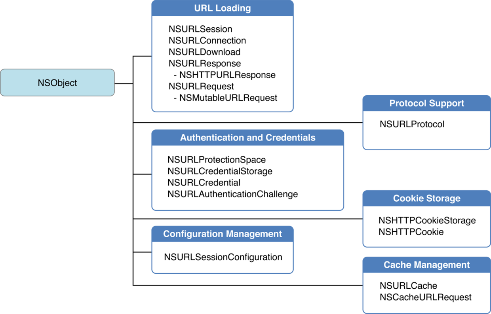

iOS端网络拦截技术

##### NSURLProtocol
NSURLProtocol是URL Loading System的重要组成部分,能够拦截拦截所有基于URL Loading System的网络请求。

可以拦截的网络请求包括NSURLSession，NSURLConnection以及UIWebVIew。
基于CFNetwork的网络请求，以及WKWebView的请求是无法拦截的。

#####如何使用NSURLProtocol
NSURLProtocol是一个抽象类。创建他的一个子类:
<pre>
@interface AppDNSInterceptor : NSURLProtocol
</pre>

分为五个步骤:
注册 -> 拦截 -> 转发 -> 回调 -> 完结

######1.注册
对于基于NSURLConnection或者使用[NSURLSession sharedSession]创建的网络请求，调用registerClass方法即可。
<pre>
[NSURLProtocol registerClass:[NSClassFromString(@"AppDNSInterceptor") class]];
</pre>
对于基于NSURLSession的网络请求，需要通过配置NSURLSessionConfiguration对象的protocolClasses属性。
<pre>
NSURLSessionConfiguration *sessionConfiguration = [NSURLSessionConfiguration defaultSessionConfiguration];
sessionConfiguration.protocolClasses = @[[NSClassFromString(@"AppDNSInterceptor") class]];
</pre>
######2.拦截

是否要处理对应的请求。由于网页存在动态链接的可能性，简单的返回YES可能会创建大量的NSURLProtocol对象，因此我们需要保证每个请求能且仅能被返回一次YES
<pre>
+(BOOL)canInitWithRequest:(NSURLRequest *)request {
    NSLog(@"request.URL.absoluteString = %@",request.URL.absoluteString);
    //只处理http| https请求
    NSString *scheme = [[request URL] scheme];
    if ([scheme caseInsensitiveCompare:@"http"] == NSOrderedSame ||
        [scheme caseInsensitiveCompare:@"https"] == NSOrderedSame) { 
        //看看是否处理过,防止无限循环
        if([NSURLProtocol propertyForKey:kAppDNSInterceptorKey inRequest:request]){
            return NO;
        }
        return YES;
    }
    return NO;
}
+(BOOL)canInitWithTask:(NSURLSessionTask *)task {
    return [self canInitWithRequest:task.currentRequest];
}
</pre>

是否要对请求进行重定向，或者修改请求头、域名等关键信息。返回一个新的NSURLRequest对象来定制业务
<pre>
+ (NSURLRequest *)canonicalRequestForRequest:(NSURLRequest *)request {
    //这里截取重定向 做定制化服务:比如修改头部信息 ,dns映射ip等操作
    NSMutableURLRequest *mutableRequest = [request mutableCopy];
    return mutableRequest;
}
</pre>
######3.转发

<pre>
-(instancetype)initWithRequest:(NSURLRequest *)request cachedResponse:(NSCachedURLResponse *)cachedResponse client:(id<NSURLProtocolClient>)client {
    
    AppDNSInterceptor *interceptor = [super initWithRequest:request cachedResponse:nil client:client];
    return interceptor;
}

-(void)startLoading {
    NSMutableURLRequest * request = self.request.mutableCopy;
    //    //给我们处理过的请求设置一个标识符, 防止无限循环,
    [NSURLProtocol setProperty: @YES forKey: kAppDNSInterceptorKey inRequest: request];
    self.connection = [NSURLConnection connectionWithRequest: request delegate: self];
}
</pre>

######4.注回调
当网络收到请求返回时,还需要在将返回值给原来网络请求
<pre>
-(void)URLProtocol:(NSURLProtocol *)protocol wasRedirectedToRequest:(NSURLRequest *)request redirectResponse:(NSURLResponse *)redirectResponse;
-(void)URLProtocol:(NSURLProtocol *)protocol cachedResponseIsValid:(NSCachedURLResponse *)cachedResponse;
-(void)URLProtocol:(NSURLProtocol *)protocol didReceiveResponse:(NSURLResponse *)response cacheStoragePolicy:(NSURLCacheStoragePolicy)policy;
-(void)URLProtocol:(NSURLProtocol *)protocol didLoadData:(NSData *)data;
-(void)URLProtocolDidFinishLoading:(NSURLProtocol *)protocol;
-(void)URLProtocol:(NSURLProtocol *)protocol didReceiveAuthenticationChallenge:(NSURLAuthenticationChallenge *)challenge;
-(void)URLProtocol:(NSURLProtocol *)protocol didCancelAuthenticationChallenge:(NSURLAuthenticationChallenge *)challenge;
</pre>

######5.完结
<pre>
- (void)stopLoading {
    [self.managerSession cancel];
    self.managerSession = nil;
    
    
    if (self.connection) {
        [self.connection cancel];
        [NSURLProtocol removePropertyForKey: kAppDNSInterceptorKey inRequest: self.connection.currentRequest.mutableCopy];
        self.connection = nil;
    }
    
}
</pre>

##参考文章

1. [网易分享 NSURLProtocol 全攻略](http://tech.lede.com/2017/02/15/rd/iOS/iOS_NSURLProtocol/)
2. [UIWebView  拦截js,css](http://www.cocoachina.com/ios/20161202/18261.html)