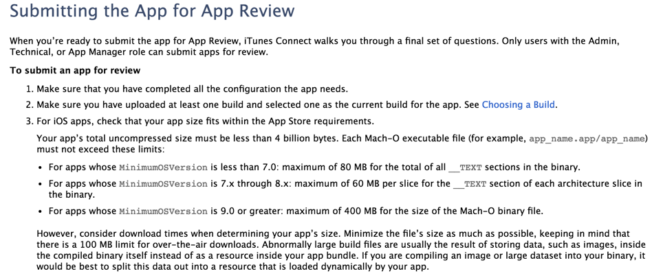

iOS IPA 变身记

随着项目开发，不断加入类文件,资源文件甚至一些第三方类库,IPA身材日益肥胖，当然Apple 对IPA身材做出了些明文规定：

从以下几个方面来优化IPA，实现变身

##1.资源优化
####1.0.0图片概念
1.什么是矢量图 矢量图是由计算机的算法产生的，可以无限放大或缩小，不会有任何损失，通常由矢量软件制作。

2.什么是位图 位图是由一个一个的小色块组成，放大后会看到那些小色块，同一面积内小色块越多，分辨率就越高。

3.矢量图的优缺点 可以无限放大或缩小，不会影响图像素质，文件体积较小，编辑灵活。缺点是表达的色彩层次不清，整体观感效果不如位图

4.位图的优缺点 不能放太大，减少文件分辨率后会影响图片质量，图片战胜空间较大，优点是能很细腻地表达图片的效果，图片表达效果非常好

5.什么情况下用位图，什么情况下用矢量图 一些对图片要求高的用位图，例如照片。其他的尽量用矢量图。例如文字、表格、卡通图片等

###1.0图片资源导入方式
图片的导入方式有如下几种：

1.加入到Assets.xcassets中

图片只支持[UIImage imageNamed]的方式实例化，但是不能从Bundle中加载，只支持png格式的图片；在编译后，Images.xcassets中的所有文件会被打包为Assets.car的文件

2.CreateGroup

黄色文件夹图标；Xcode中分文件夹，Bundle中所有所在都在同一个文件夹下，因此，不能出现文件重名的情况
可以直接使用[NSBundle mainBundle]作为真实路径，效率高！
可以使用[UIImage imageNamed:]加载图像

3.CreateFolderRefences

蓝色文件夹；Xcode中分文件夹，Bundle中同样分文件夹，因此，可以出现文件重名的情况
需要在[NSBundle mainBundle]的基础上拼接实际的路径，效率较差
不能使用[UIImage imageNamed:]加载图

4.PDFs矢量图（Xcode6+）

5.Bundle（包）中的图片素材

6.可以使用iConfont
[看这里](http://johnwong.github.io/mobile/2015/04/03/using-icon-font-in-ios.html)

###1.1删除无用资源
删除项目中无用的文件，如被弃用的类、图片等

大家可以使用 [这个工具来](https://github.com/softwarefaith/WHC_ScanUnreferenceImageTool)扫描无用图片。
另外建议大家一定要在项目当中确认下?可能有些图片名字使用方式不同，比如 xxx_1 ,xxx_2,xxx_3,有些人可能会使用循环遍历的方式引用，导致成为无用图片

###1.2资源压缩
对于图片来说,可以使用图片压缩工具，通过无损或有损压缩的方式减小图片大小。
介绍一款[imageoptim](https://imageoptim.com)图像“瘦身”软件，内置有6种压缩算法，通过删除图片部分无用的EXIF等信息来减小PNG、JPEG和GIF图片的大小。

另外对于一些项目可能会用到音频或视频资源,也可以考虑压缩。

补充：
****尽量使用8-bit图片****
使用8-bit的PNG图片，比32-bit的图片能减少4倍的压缩率。由于8-bit的图片支持最多256种不同的颜色，所以8-bit的图片一般只应该用于一小部分的颜色图片。例如灰度图片最好使用8-bit。
****针对32-bit的图片尽量使用高压缩的比率****

##2.可执行文件的文件优化

####2.0 LinkMap概念
LinkMap文件是Xcode产生可执行文件的同时生成的链接信息，用来描述可执行文件的构造成分，包括代码段（__TEXT）和数据段（__DATA）的分布情况。只要设置Project->Build Settings->Write Link Map File为YES，并设置Path to Link Map File，build完后就可以在设置的路径看到LinkMap文件了。
 可以使用
 [LinkMap工具来找出哪些文件 占用 多少大小](https://github.com/huanxsd/LinkMap
)

****LinkMap文件可以帮助我们寻找优化点***

#####2.1.删除未使用类
####2.2删除无用selector
####2.3扫描重复代码
####2.4编译设置

1.Build Settings->Optimization Level
release版应该选择Fastest, Smalllest，这个选项会开启那些不增加代码大小的全部优化，并让可执行文件尽可能小。

2.Strip Linked Product / Deployment Postprocessing / Symbols Hidden by Default 在release版本应该设为yes，可以去除不必要的调试符号。Symbols Hidden by Default会把所有符号都定义成”private extern”，详细信息见官方文档。

原理是打开这两个选项后构建ipa会去除掉symbol符号，就是那些类名啊函数名啊啥的。这样子的影响就是运行时你没法进行线程回溯，符号都没了回溯了也是乱码。但是不会影响正常的崩溃日志生成和解析。在本机专门测试过，如果使用符号表来解析崩溃日志，则完全不受影响。

详细的可以参考[Apple 文档](https://developer.apple.com/library/content/documentation/DeveloperTools/Conceptual/MachOTopics/1-Articles/executing_files.html#//apple_ref/doc/uid/TP40001829-97021-TPXREF121)

##参考文章

1.[iOS微信安装包瘦身](http://www.cocoachina.com/ios/20151211/14562.html)

2.[iOS可执行文件瘦身方法](http://blog.cnbang.net/tech/2544/)

3.[iOS APP可执行文件的组成](http://blog.cnbang.net/tech/2296/)

4.[笔记](https://github.com/Damonvvong/iOSDevNotes/blob/master/Notes/AppBetter_1.md)
