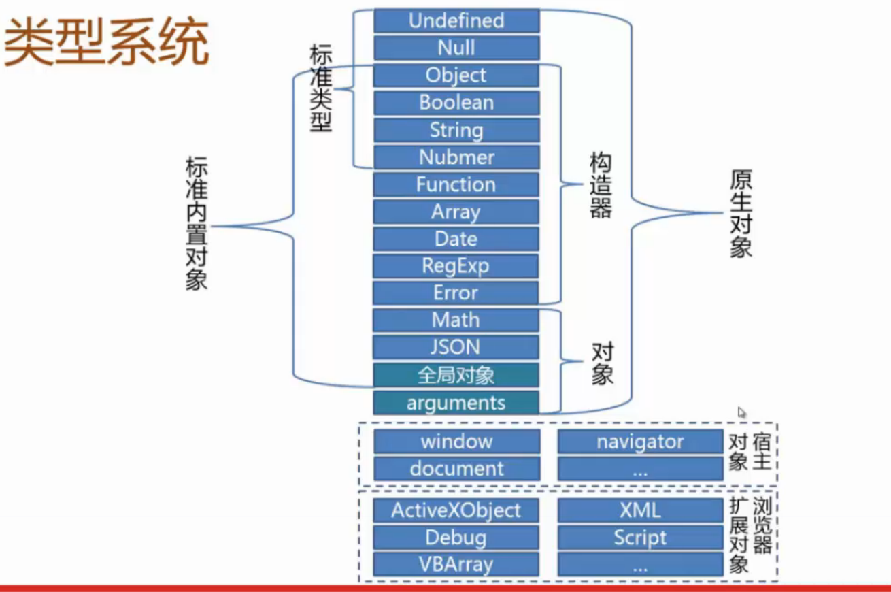

#JS类型总结

##JS类型系统

##内置对象
由类型图可知标准内置对象可以分为两类：构造器对象，其他对象

1.普通对象

- 说明
- 属性，方法

2.构造器对象

- 构造器说明
- 构造器实例化对象方法
- 属性，方法
- 原型对象属性，方法
- 实例对象的属性，方法

###Object

1.说明
- Object是一组属性方法的集合
- String/Number/Boolean/Array/Date/Error构造器都是Object子类对象，继承Object原型对象属性和方法

2.实例化对象方法
- var obj = new Object({name:'caicai'});
- var obj = {name : 'caicai'};

3.属性，方法

- prototype -

4.原型对象属性，方法

- construct,toString,valueOf,hasOwnProperty

##JS类型识别
###typeof

- 可以识别标准类型(Null除外)
- 不能识别具体的对象类型（Function 除外）

###Object.prototype.toString

- 可以识别标准类型以及内置对象类型
- 不能识别自定义类型

###constructor

- 识别标准类型（Undefined/Null除外）
- 识别内置对象类型
- 识别自定义对象类型

###instanceof

- 判别内置对象类型
- 不能判别原始类型<ECMAScript中包含五种原始类型，即Undefined、Null、Number、Boolean、String，注意：String类型在JavaScript中属于原始类型 ，这点不同于Java、C#等语言。>
- 判别自定义对象类型

