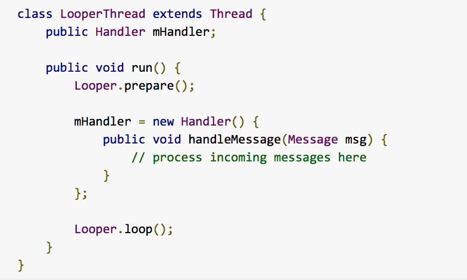
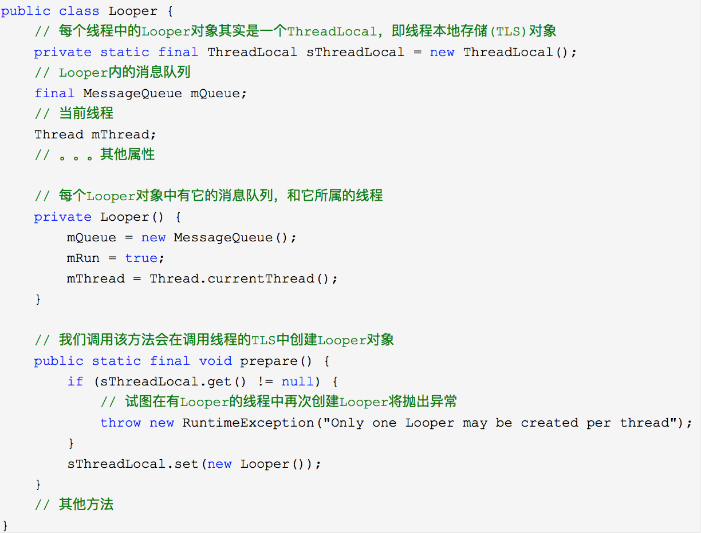
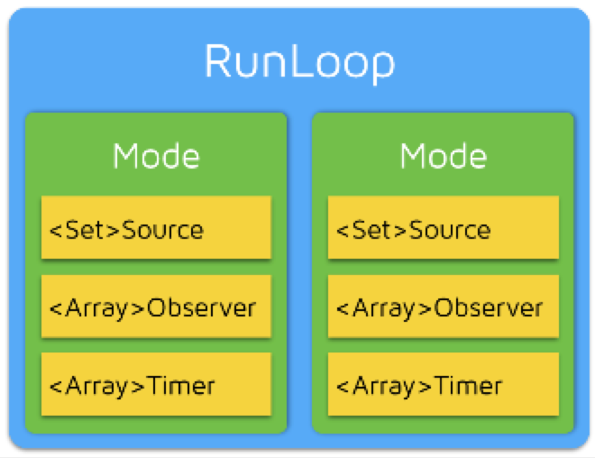
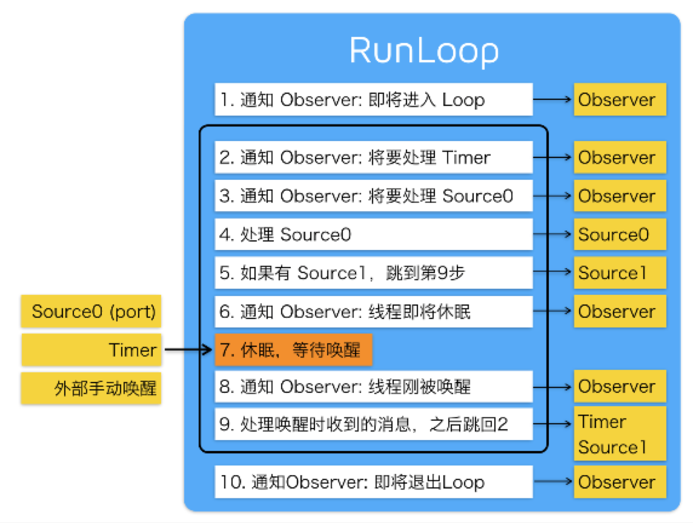

#从安卓的Looper到iOS的RunLoop

##-简介
  最近学习安卓，学到Looper，回想起iOS RunLooper有很多的共通之处。我在这里做些对比学习。
  一般来讲，一个线程一次只能执行一个任务，执行完成后线程就会退出。如果我们需要一个机制，让线程能随时处理事件但并不退出，通常的设计大概是这样： 
  			
  			do {
  	            handle message;  
  	         }while(!quit);
  
  这种模型通常被称作 ***Event Loop***。 Event Loop 在很多系统和框架里都有实现,目的就是为了**事件/消息处理**
  
  事件处理过程中，OSX/iOS 系统中，提供了两个这样的对象：NSRunLoop 和 CFRunLoopRef。
***CFRunLoopRef***([代码开源](http://opensource.apple.com/tarballs/CF/))是在 CoreFoundation 框架内的，它提供了纯 C 函数的 API，所有这些 API 都是线程安全的。.
***NSRunLoop*** 是基于 CFRunLoopRef 的封装，提供了面向对象的 API，但是这些 API 不是线程安全的。 
而Android消息处理有三个核心类：***Looper,Handler以及Message***.其中里面还存在一个隐藏的消息队列Message Queue（内部封装不直接交互）。

##-Looper
looper顾名思义有循环之意，在安卓中我们是这样使用它的：

从图中可以看出Looper提供了一种消息循环机制，主要为Handler服务。而且每一个Handler实例只能服务于一个线程和它的消息队列,线程升级为Looper线程，一定要注意：***一个Thread只能有一个Looper对象***。

这里简单的介绍下ThreadLocal:维护本地变量，为每个使用该变量的线程提供独立的变量副本，所以每一个线程都可以独立地改变自己的副本，而不会影响其它线程所对应的副本。
分析Looper.prepare准备工作核心就是将looper对象定义为ThreadLocal,将线程加入到Looper的队列MessageQueue.
当调用Looper.loop（）才开始真正的工作起来，它不断从自己的MQ中取出队头的消息(也叫任务)执行,如以下代码： 

通过以上的分析，我们占时了解到一下几点：
总结几点：
1.每个线程有且最多只能有一个Looper对象，它是一个ThreadLocal
2.Looper内部有一个消息队列，loop()方法调用后线程开始不断从队列中取出消息执行
3.Looper使一个线程变成Looper线程。
另外Looper当中还有其他的方法，在这里不做介绍了。
***
###再来思考下看看iOS当中RunLoop是什么？与线程存在何种关系？
   在iOS中，利用***CFRunLoopGetMain() 和 CFRunLoopGetCurrent()***直接创建RunLoop
   
   从代码中，可以看出来，**线程和 RunLoop 之间是一一对应的，其关系是保存在一个全局的 Dictionary 里**，而且Thread作为key来获取对应的RunLoop对象。与安卓相比，获取looper方式
   
     public static final Looper myLooper() {
        // 在任意线程调用Looper.myLooper()返回的都是那个线程的looper
        return (Looper)sThreadLocal.get();
    }
    
  Looper是一个对象，RunLoop 实际上也就是一个对象，他们共同管理了其需要处理的事件和消息，并提供了一个入口函数来执行上面 Event Loop 的逻辑。更重要的是一直处于这个函数内部 "接受消息->等待->处理" 的循环中，直到这个循环结束。从整个application来再次里考虑，都存在主线程，main loop时刻处理着消息事件。
  
  再来分析下RunLoop组成:
  
  
  在CoreFoundation存在以下五个类： 
      *CFRunLoopRef 
      *CFRunLoopModeRef 
      *CFRunLoopSourceRef:事件产生的地方 
      *CFRunLoopTimerRef:基于时间的触发器 
      *CFRunLoopObserverRef:观察者 
      
   
       RunLoop : Mode = 1: N; 而调用RunLoop主函数时，只能指定一个Mode 
       Mode : mode item(source|Observe|Timer) = 1:N; 
       
   苹果不允许直接创建 RunLoop，它只提供了两个自动获取的函数：CFRunLoopGetMain() 和 CFRunLoopGetCurrent()。你只能通过 mode name 来操作内部的 mode，当你传入一个新的 mode name 但 RunLoop 内部没有对应 mode 时，RunLoop会自动帮你创建对应的 CFRunLoopModeRef。对于一个 RunLoop 来说，其内部的 mode 只能增加不能删除。
***
###安卓Looper流程
   handler通知MQ它要执行一个任务(sendMessage)，并在loop到自己的时候执行该任务(handleMessage)，整个过程是异步的；handler创建时会关联一个looper，默认的构造方法将关联当前线程的looper，不过这也是可以set的。
   Handler的用处： 
   1.handler可以在任意线程发送消息，这些消息会被添加到关联的MQ上。
   2.handler是在它关联的looper线程中处理消息的。
 
   ***从安卓Looper来看，iOS 主线程关联一个Main Loop,维护类似队列更新UI事件，间接做到线程安全，提高了性能***
   最后看一张RunLoop流程图
   

  
