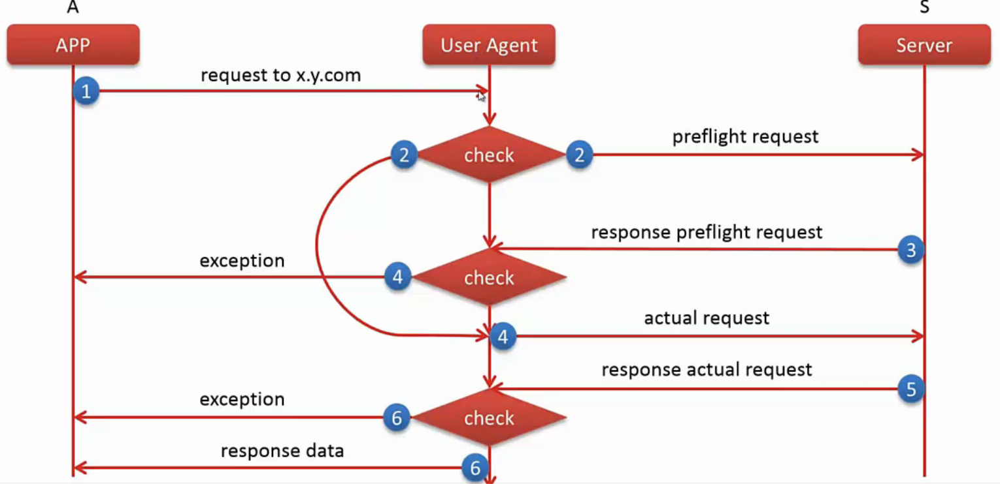
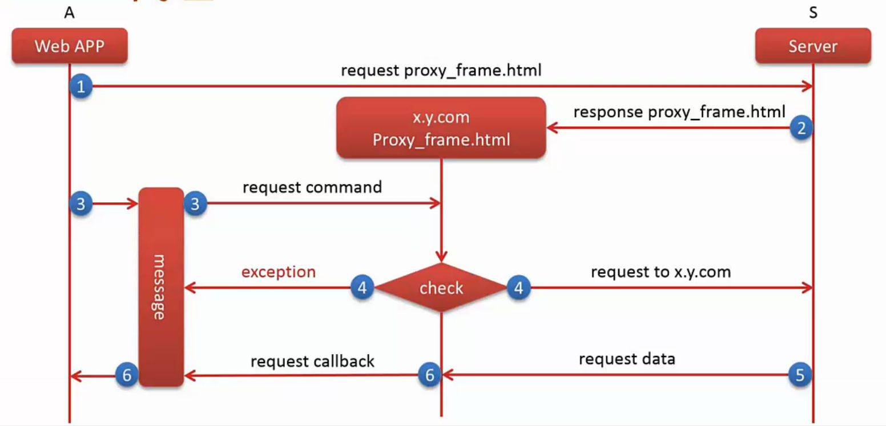

#数据管理

##数据访问

####Ajax
Asynchronous JavaScript and XML

1.通信流程

- XHR
  
  readyState:0
  status:
  responseText:
  
- open()

   readyState:1 开启请求
- send()

   readyState:2; 发起请求
   
- 浏览器接收数据

  readyState:3; 

- 浏览器接收数据结束请求

    readyState:4; status:200; responseText:<!DOCTYPE html> 
    
    
2.操作

- 创建xhr对象

<code>
var xhr = new XMLHttpRequest();
</code>

- 处理返回数据
<pre>
xhr.onreadystatechange = funtion(callback){

 if(xhr.readyState == 4){	
 
    callback(xhr.responseText);
  } else{
	
  }
}

2.0 
xhr.onload()  //调用时机：readyState == 4 && status ==200 调用
</pre>

- 发送请求
<pre>
xhr.open(method,url,asyn[默认为ture]); //请求方式，请求参数序列化
xhr.setRequestHeader(header,value); //设置头部信息
xhr.send([data = null]); //请求体  String / FormData
</pre>

3.知识点

- 同源策略
<code>
两个页面拥有相同的协议，端口和主机，那么这两个页面就属于同一个源。
</code>

- 跨域资源访问

<pre>
1.不满足同源策略资源访问，叫跨域资源访问
2.W3C定义了CORS
3.现代浏览器已经实现了对CORS的支持
</pre>

- 跨域技术解决方案

1.CORS

2.Frame代理

3.JSONP
JSON with padding
<script>可以跨域
请求一段js代码
4.Comet

5.Web Socket

##数据存储
###cookie

1.了解
- 小型文本文件
- 键值对
- 返回体 Set-Cookie  设置

2.属性
- Name
- Value
- Domain 			作用域（默认当前文档域）
- Path          	作用路径（默认文档路径）
- Expires/Max-Age   失效时间(浏览器会话时间)
- Secure			https协议时生效（默认为false）

2.读取

3.设置/修改
document.cookie

4.缺陷
- 流量代价
- 安全性问题
- 大小限制 4KB
