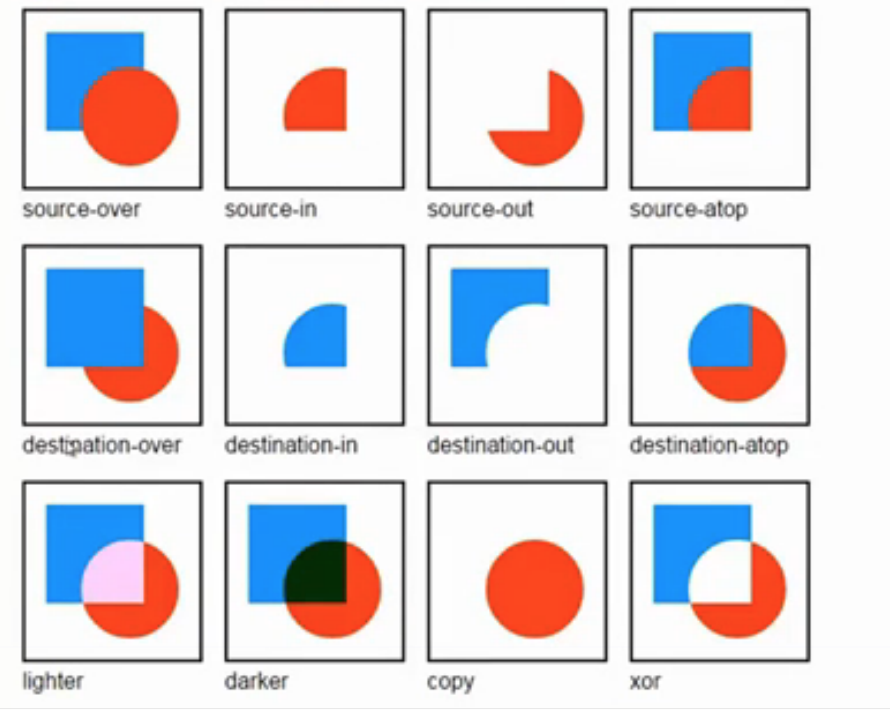

#dom2 音频

##概括

##基本用法
- <audio src=“”> </audio>

- <video src=“”> </video>
区别显示内容
兼容性
<source src="" type="">

var audio = new Audio();
audio.canplayType("")

##多媒体的控制

##多媒体的控制事件

##<canvas>
- 属性 width = 300 height= 150

- 渲染上下文

  var ctx = canvas,getContext('2d');
  
  ctx.globalCompositeOperation = "destination-over";
  
  
  
  
- 基本绘图步骤
  

####其他内容
音频：<http://en.wikipedia.org/wiki/HTML5_Audio#Supported_audio_coding_formats>
视频：<http://en.wikipedia.org/wiki/HTML5_video#Browser_support>
事件列表：<http://www.w3.org/wiki/HTML/Elements/audio#Media_Events>
W3C官方定义：<http://webaudio.github.io/web-audio-api/>
mozilla官方教程：<https://developer.mozilla.org/en-US/docs/Web/API/Web_Audio_API>
第三方教程：<http://www.html5rocks.com/en/tutorials/webaudio/intro/,http://webaudioapi.com/>