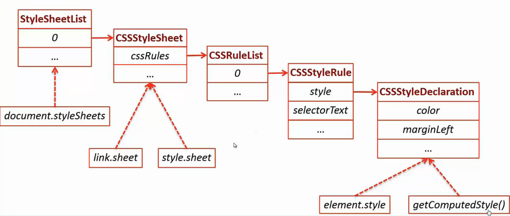

#DOM

##什么是DOM
 文档对象模型（Document Object Model，简称DOM）；在网页上，组织页面（或文档）的对象被组织在一个树形结构中，用来表示文档中对象的标准模型就称为DOM。
 
 
##DOM树

- 整个文档是一个文档节点 
- 每个 HTML 标签是一个元素节点 
- 包含在 HTML 元素中的文本是文本节点 
- 每一个 HTML 属性是一个属性节点 
- 注释属于注释节点 
- Node 层次 
- 节点彼此都有等级关系。 

###节点遍历
#####node:
parentNode; 父节点
firstChild;lastChild; 子节点
previousSibling;nextSibling; 兄弟节点

###节点类型
节点包括以下信息：[nodeName、nodeValue 以及 nodeType]  
注释：nodeName 所包含的 XML 元素的标签名称永远是大写的 

- 元素节点  [标签名称，null，1]
- 属性节点  [属性名称，属性值，2]
- 文本节点  [#text,包含文本，3]
- 注释节点   [#comment，注释文本，8]
- 文档类型节点 [#document,null，9]

###元素遍历
1.子孙关系

+ firstElementChild;
+ lastElementChild;

2.兄弟关系

+ nextElementSibling
+ previousElementSibling

###节点操作
#####获取节点
1.父子关系

+ parentNode;
+ firstChild / lastChild / childNodes
+ childNodes / children

2.兄弟关系

+ previousSibling / nextSilbing
+ previousElementSiling / nextElementSiling

***Node*** 1，2方式获取节点***可维护性差***

3.接口方式获取节点

- document.getElementById   
- collection = element.getElementsByTagName  

	在此基础山通过下标获取某个元素  
	传入 * 获取element下所有的元素 
	返回动态集合，live

- collection = element.getElementsByClassName

    一个元素可以有多个类名 
    返回动态集合，live

- list = element.querySelector/All

   返回的list是静态的，如果之前有 remove node操作  不影响
   
   
#####创建节点
- element = document.createElement(tagName);

#####修改节点

- element.textContent   (IE9以下不支持)
- element.innerText    （不规范，ff不支持）

#####插入节点
- var achild = element.appendChild(achild);
- var achild = element.insertBefore(achild,refenceChild);

#####删除节点
- var child = element.removeChild(child);

####innerHTML

- element.innerHTML();

    节点HTML内容，提高开发效率 
    内存泄露，之前设置的事件被清掉 
    安全问题，html不检查内容
    仅建议新的节点  不涉及用户的信息

NOTE:***节点以及其后代节点的文本内容*** 

####属性操作

 - property accessor 属性获取器
 
  element.className;  element['id']; element.value; 
  Bool型属性 出现默认为 ture
  
  ***Note:*** 通用性-名字异常； 扩展性差； 具备实用对象优势
 
 
 - getAttribute / setAttribute
 
 var attribute = element.getAttribute(attributeName);
 
 element.setAttribute(name,value);
 
 ***Note***  仅字符串 但是 通用性强
 
 
 - dataset
 
 自定义属性；
 HTMLElement.dataset;
 data-* 属性集
 元素上保存数据
 
 
###样式操作

外部样式，嵌入式样式 element.sheet; 所有的document.styleSheets;  
内部样式 			  element.style    
 
element.sheet.cssRules  css规则样式列表 
element.sheet.cssRules[location].style   
通过属性选择器访问具体的样式 .selectorText 样式名称 
另外 style为CSSStyleDeclaration 

######更新样式：
- element.style.property = ?  设置单个属性
- element.style.cssText =  ？ 设置多个属性
缺点：样式混在逻辑中

解决方案： element.className += "class";
一次更新很多元素的样式 更换样式表：跟换---外部样式.href = ""

######获取样式

element.style 获取不到实际的样式
获取通用的样式：var style = window.getComputedStyle(element).property;
IE9 使用element.currentStyle

######CSS DOM overview

 
 DOM Core
 DOM HTML
 DOM Style
 DOm Event