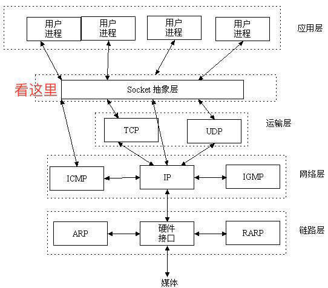
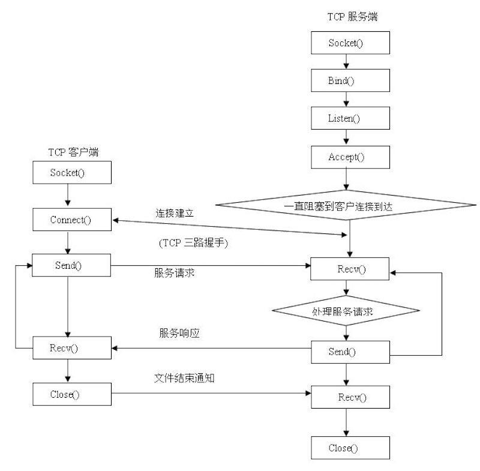
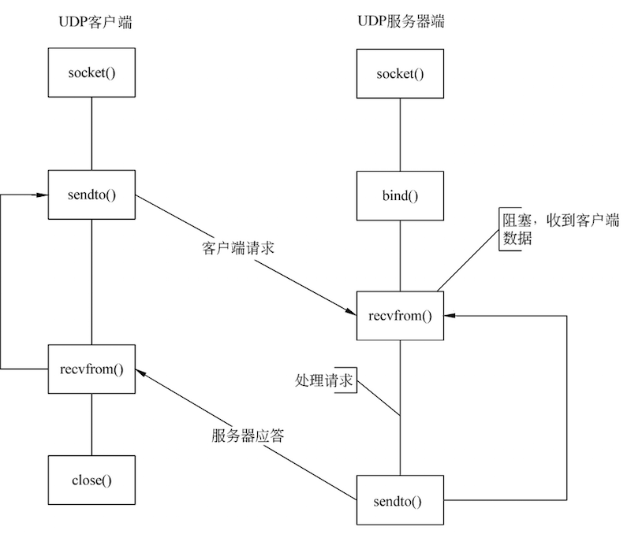

#Socket学习笔记

###Socket基础知识

#####背景
	  应用层通过传输层进行数据通信时，TCP会遇到同时为多个应用程序进程提供并发服务的问题。多个TCP连接或多个应用程序进程可能需要通过同一个 TCP协议端口传输数据。为了区别不同的应用程序进程和连接，许多计算机操作系统为应用程序与TCP／IP协议交互提供了套接字(Socket)接口。应用层可以和传输层通过Socket接口，区分来自不同应用程序进程或网络连接的通信，实现数据传输的并发服务。

#####Socket概念

- Socket 又称"套接字"，是系统提供的用于网络通信的方法。 它的本质并不是协议， 而是一个***调用接口(API)***。 通过 Socket ， 我们才能使用 TCP/IP 协议。

- 套接字（socket）是网络通信过程中端点的抽象表示，包含进行网络通信必须的五种信息：连接使用的协议，本地主机的IP地址，本地进程的协议端口，远地主机的IP地址，远地进程的协议端口。

####Socket支持的协议
Socket可以支持不同的传输层协议（TCP或UDP）,具体采用哪种协议，有业务场景来决定;
#####TCP
TCP是面向连接的、传输可靠(保证数据正确性且保证数据顺序)、用于传输大量数据(流模式)、速度慢，建立连接需要开销较多(时间，系统资源)。

TCP是一种流模式的协议，是面向连接的，也就是说，在连接持续的过程中，socket中收到的数据都是由同一台主机发出的（劫持什么的不考虑），因此，知道保证数据是有序的到达就行了，至于每次读取多少数据不关心。

#####UDP
UDP是面向无连接、传输不可靠、用于传输少量数据(数据包模式)、速度快的传输层协议。注意，UDP传输的是数据报包，而TCP是流。

UDP是面向无连接的协议，只要知道接收端的IP和端口，且网络是可达的，任何主机都可以向接收端发送数据。这时候，如果一次能读取超过一个报文的数据，则会乱套。比如，主机A向发送了报文P1，主机B发送了报文P2，如果能够读取超过一个报文的数据，那么就会将P1和P2的数据合并在了一起，这样的数据是没有意义的。

关于UDP 广播 多播概念可以移步这里<http://www.jianshu.com/p/41c2a53d719b>

####Socket连接基本步骤

  建立Socket连接至少需要一对套接字，其中一个运行于客户端，称为ClientSocket; 另一个运行于服务器端，称为ServerSocket。
  
#####socket通信过程如下：

- 服务端利用Socket监听端口；
- 客户端发起连接；
- 服务端返回信息，建立连接，开始通信；
- 客户端，服务端断开连接。

#####套接字之间的连接过程分为三个步骤：

- 服务器监听：服务器端套接字并不定位具体的客户端套接字，而是处于等待连接的状态，实时监控网络状态，等待客户端的连接请求

- 客户端请求：客户端的套接字提出连接请求，要连接到目标服务器端的套接字。为此，客户端的套接字必须首先描述它要连接的服务器的套接字，指出服务器端套接字的地址和端口号，然后就向服务器端套接字提出连接请求
- 连接确认：当服务器端的套接字监听到或者说接收到客户端的套接字的连接请求时，就响应客户端套接字的请求，建立一个新的线程，把服务器端套接字的描述发给客户端，一旦客户端确认了此描述，双方就正式建立连接。而服务器端套接字继续处于监听状态，继续接收其他客户端套接字的连接请求

###iOS端Socket编程

既可以C语言 也可以 OC语言实现，
目前第三方库中比较好的是 CocoaAsyncSocket。

##参考学习文章
1.Soket 理论知识<http://www.jianshu.com/p/06f8b9111a56>

